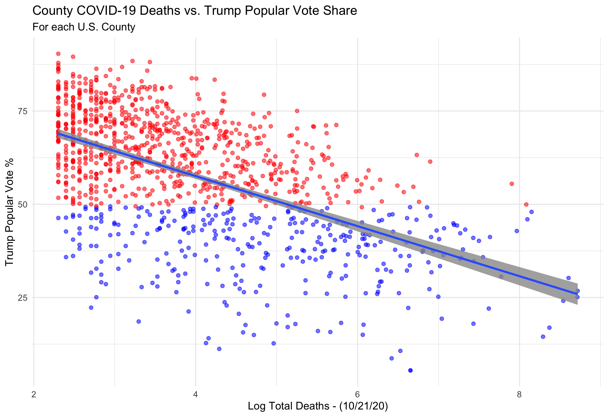
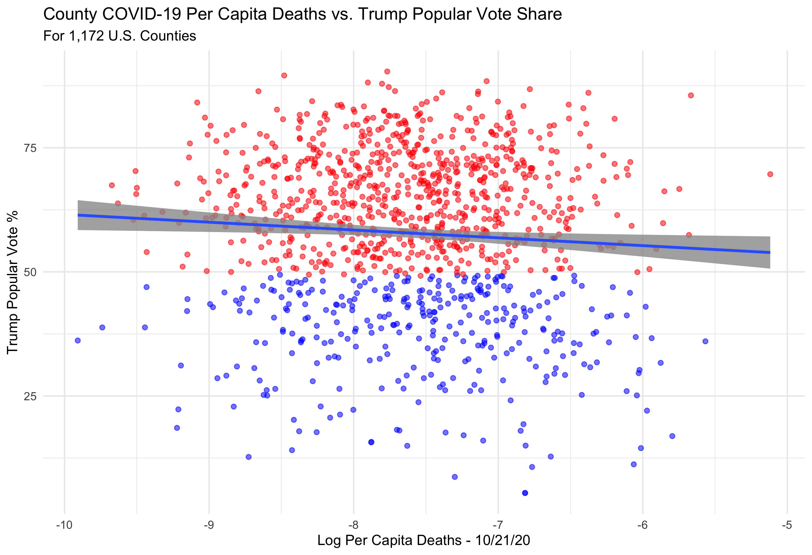
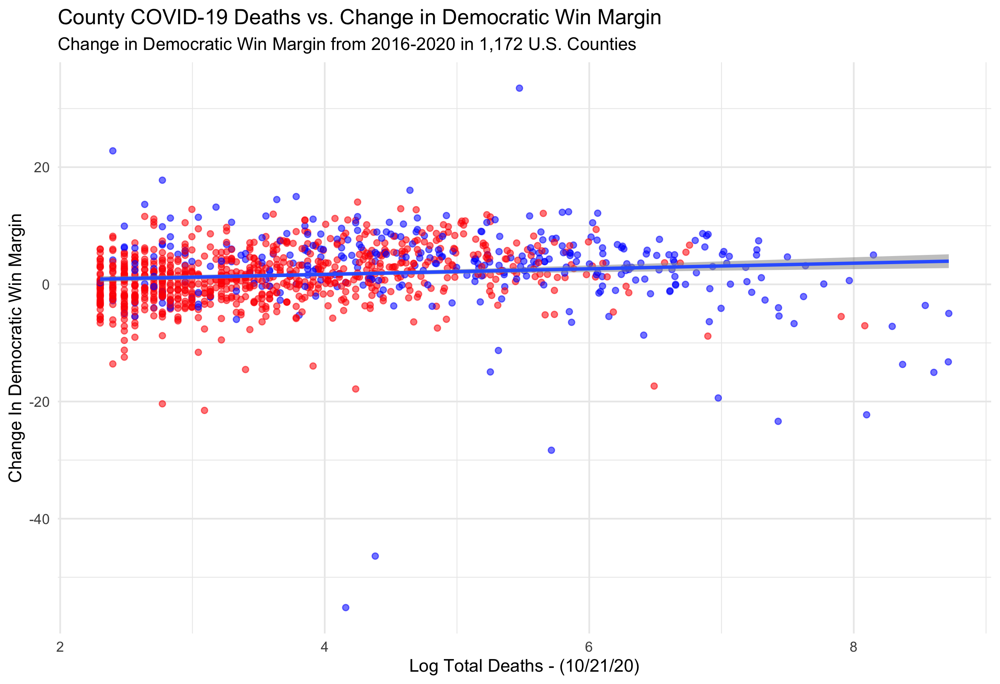
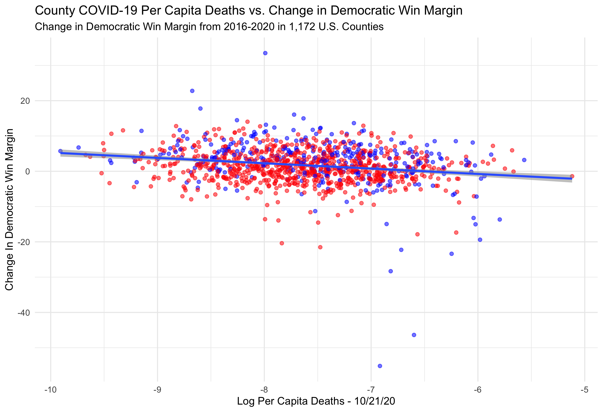
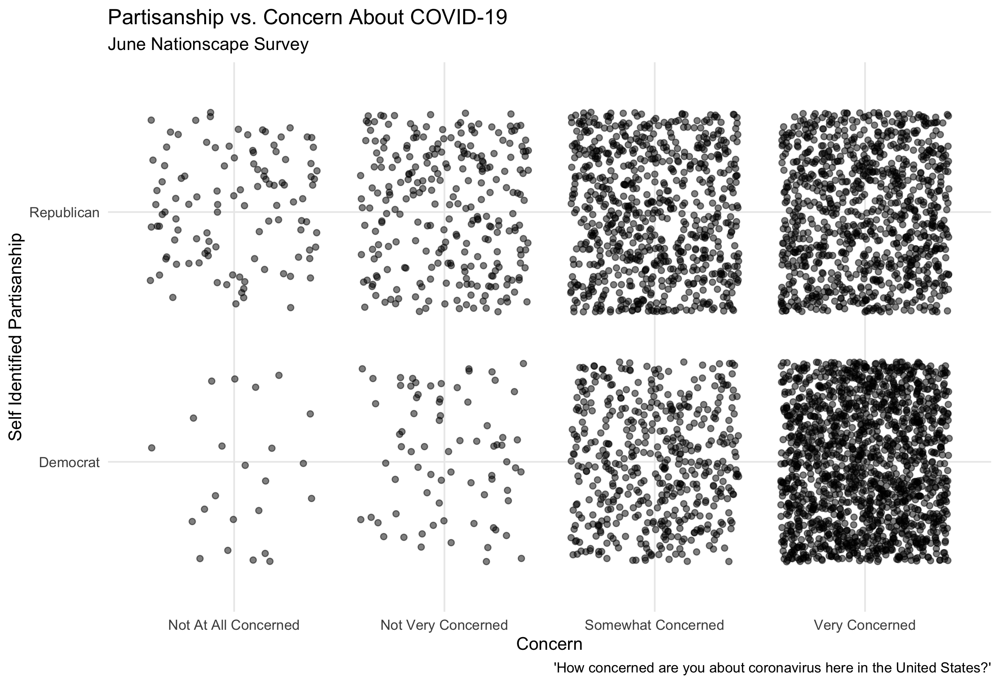
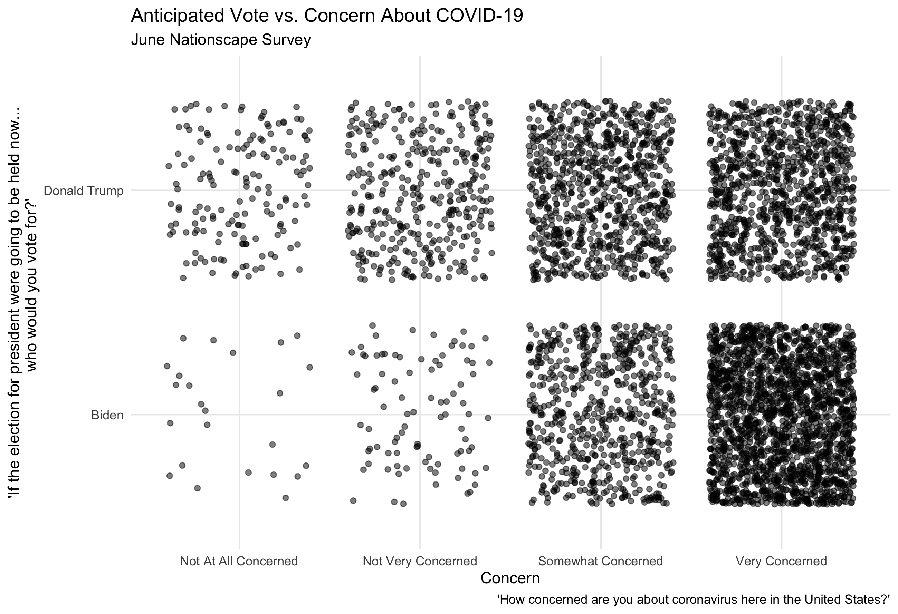
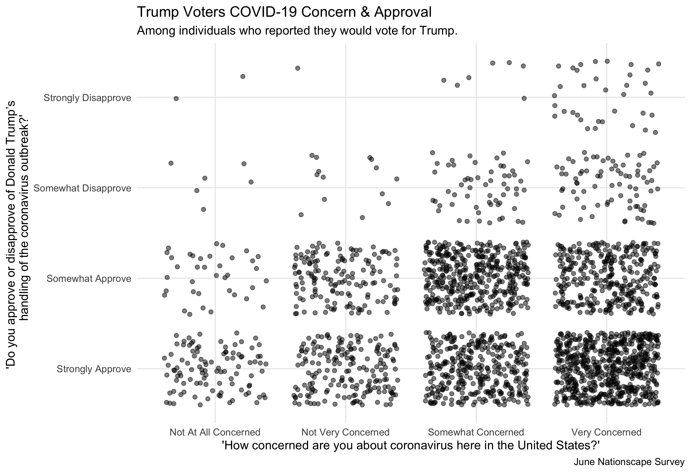
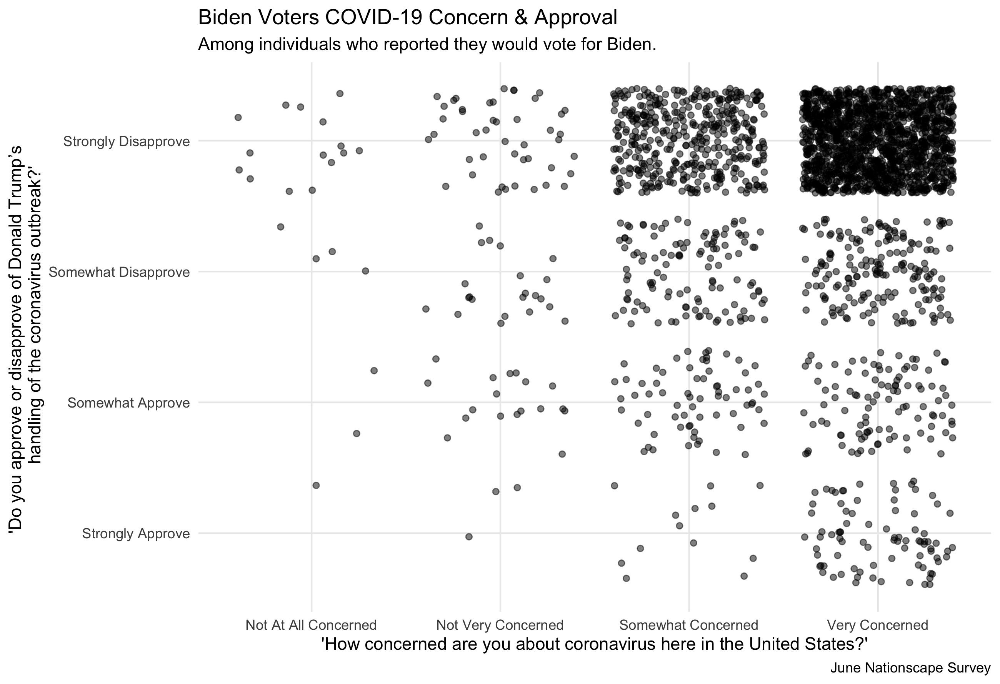
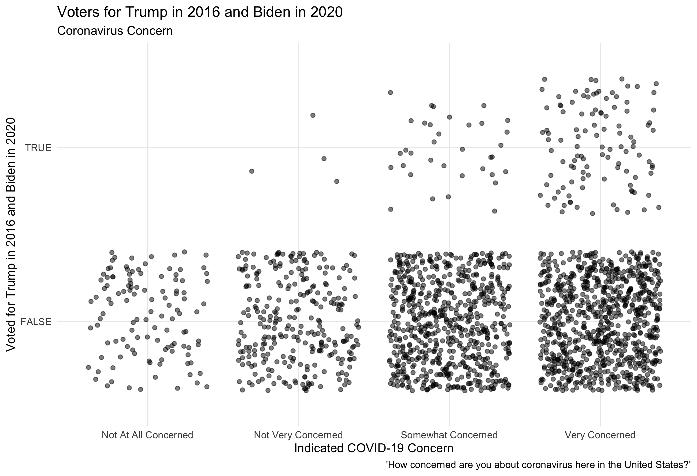
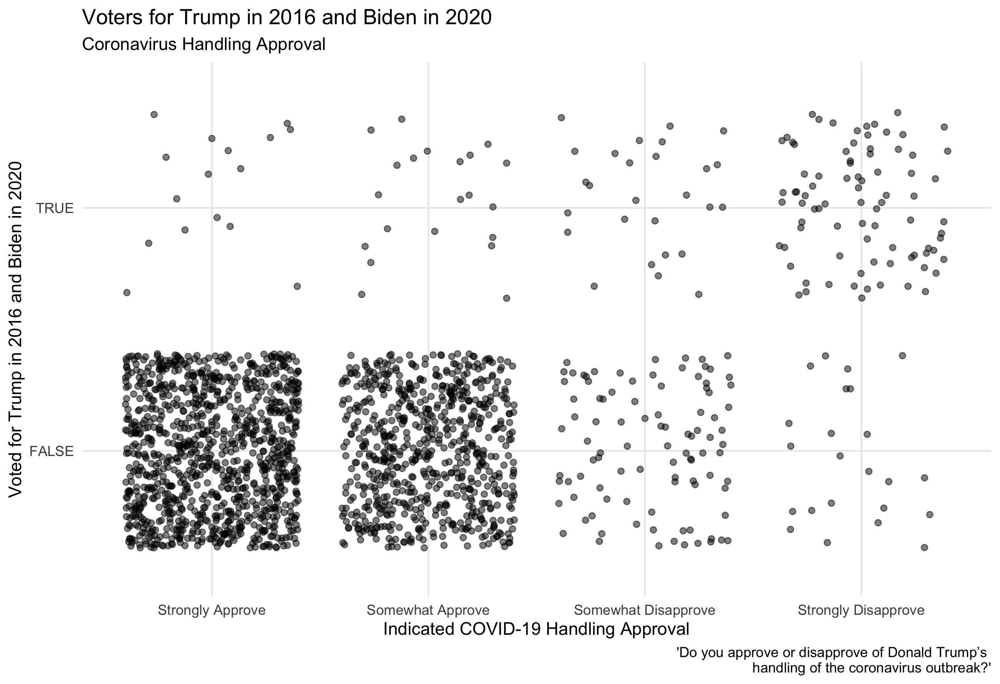

#### [Home](https://cassidybargell.github.io/election_analytics/)

# Election Narrative
## 12/10/20

## How Did COVID-19 Impact the Election and Voters?
### Media Narrative Exploration

As of December 9th 2020, COVID-19 has killed 285,351 Americans [(CDC)](https://covid.cdc.gov/covid-data-tracker/#cases_casesper100klast7days). On election day alone there were 1,130 COVID-19 deaths recorded in the U.S. The pandemic has been devastating, impacting nearly every aspect of life, including the 2020 Presidential Election. From the increase in mail-in ballot use, to Trump contracting the virus himself and refusing a virtual second debate, COVID-19 has had several direct impacts on the election process.

Now that the election has concluded and Biden has been declared President-Elect, there has been more speculation on the larger possible impacts of the virus on the election. How did the virus influence voters in their decision on which candidate to vote for? Did COVID-19 help Biden win, or did it have less of an impact on voters than one might expect given the severity of the pandemic? 

Several media narratives have begun to speculate on the causal effect of COVID-19 on the outcome of the election. A [USA Today](https://www.usatoday.com/story/news/politics/elections/2020/11/09/covid-19-shaped-2020-election-amid-split-biden-trump-response/3729201001/) headline claimed COVID-19 "[swung] some voters to Biden but [bolstered] Trump with his base". [The Washington Post](https://www-washingtonpost-com.ezp-prod1.hul.harvard.edu/elections/interactive/2020/trump-pandemic-coronavirus-election/ions/interactive/2020/trump-pandemic-coronavirus-election/) has published an article on why "Trump's erratic behavior and failure on coronavirus doomed his reelection". [The Guardian](https://www.theguardian.com/world/2020/nov/04/exit-polls-economy-covid-lockdown-trump) noted that "Fears about the economy under lockdown helped Trump outperform [the] polls", and [Time Magazine](https://time.com/5910256/covid-19-presidential-election-outcome/) pointed out a potential paradox, that "Where the virus was the worst, voters supported Trump the most".

It is critical we understand how COVID-19 impacted the election because it has large implications for how future elections will run. The impact of the pandemic on voting offers new and valuable insight into how large shocks affect voter decision making. It would be important to know if COVID-19 deaths and severity impacted how Americans voted, or if the pandemic has largely just become another partisan issue. Understanding how a shock this large impacted American voters will impact what future campaigns focus on, and how they spend their money.

Understanding the true causal impact the virus had on voter decision making is beyond the scope of this blog post, there are some testable implications of the claims being made by the media about the effect COVID-19 had on the election outcome. **If the virus was worst where Trump had the most support, then we would expect to see a positive correlation between deaths (either in total or per capita) and popular vote share for Trump**. This claim can begin to be examined using county level data about voting outcomes and COVID-19 death totals (as of 10/21/20) for 1,172 U.S. counties. 

When the log* of total deaths is plotted versus percentage of popular vote share for Trump in counties, a negative relationship is observed.

When per capita death tolls, however, are examined rather than total death tolls, the negative relationship is significantly weakened. 

I believe the difference in these graphs is reflective of the urban-rural partisan divide. Although there are more total deaths in larger, urban, Democratic-leaning areas, per capita death rates take into account population sizes, and therefore are more useful when comparing between populations. Either way, these graphs do not show initial support for the media claim that Trump had more support where coronavirus was the worst.

The change in vote share from 2016 to 2020 in counties can also be examined in order to understand how Trump either made or lost ground this election. If the virus was worse where Trump had the most support, you might expect to see higher death rates in areas that had a larger shift towards Trump in 2020.

Examining change from 2016 is also useful in potentially evaluating any claims that the severity of a virus in an area either hurt or helped a candidate. 2016 county popular vote outcomes were generally highly predictive of 2020 county popular votes. A relationship between large changes in popular vote share and coronavirus deaths might indicate that the severity of COVID-19 in an area had an impact on support for a candidate. 

Instead what we see is that there does not seem to be a strong relationship between change in Democrat win margin from 2016 to 2020 and death rates. In fact the relationship seems slightly positive when examined using total deaths, and slightly negative when examined using per capita deaths.

From this very preliminary examination it does not appear that in counties where there was a high death toll there was a strong shift either left or right in this election. Death rates is not the only way COVID-19 has impacted communities. Effects like the economic toll of the virus in an area might instead be what primarily influences voters in various counties to support Trump.

The outliers (at the bottom of the above graph) had the largest swing *towards* Trump this election (a large decrease in Democratic win margin, although many of the counties were still won by Biden). The top four counties with largest swings right were in Texas -- in or around the Rio Grande Valley (Starr County, Maverick County, Webb County and Hidalgo County). The fifth largest swing right came from Miami-Dade in Florida.

Miami-Dade county highlights the danger of succumbing to ecological fallacies through this broad type of analysis. One could incorrectly draw the conclusion that a high coronavirus death rates in this county caused a large swing right this election by looking at ecological data. In reality we cannot draw sweeping conclusions like that from this type of data. Rather, examining ecological data like I have done above is useful in providing a starting point to understand if some of the large claims that are being made hold weight to begin with. 

Some of the other claims by the media, like about how Trump's handling of the virus hurt his reelection chances, can begin to be examined using polling data which gives more insight into what voters are actually thinking. 

The Nationscape survey is a large scale survey conducted by UCLA Political Scientists Chris Tausanovitch and Lynn Vavreck and the Democracy Fund Voter Study Group [(VSG)](https://www.voterstudygroup.org/publication/nationscape-data-set). It is a large public opinion survey project. In the following analysis I will be using Wave 50 of the survey, which was conducted between June 25th and July 1st, 2020 and surveyed 6,476 participants. As Nationscape data is a public opinion survey, there are still concerns about its overall representativeness, however in comparison with government benchmarks and other online survey samples it seems to produce valid results. It's large sample sizes are also a strength.

In many ways the virus has been highly politicized this year, making it a partisan issue. This divide in concern over the virus can be visualized using Nationscape data. Self-identified Liberals and Biden voters are on average more concerned about the virus than self-identified Conservatives and Trump voters. 

Concern over the virus does not necessarily indicate low approval of Donald Trump's handling of the pandemic. Approval of the handling of the virus is where a larger partisan divide can be observed.

If Trump's handling of the virus hurt his reelection chances, I would expect that people who switched from voting for Trump in 2016 to Biden in 2020 disapproved of his handling of the pandemic, and were highly concerned about the virus. The "TRUE" in the graphs below row represents these switchers, people who voted for Trump in 2016 and Biden in 2020. For this media claim to be true, among the switchers I would expect there to be greater concern about the virus, and stronger disapproval of Trump's handling of it.

This general trend appears to be true in this Nationscape data, that those switching in 2020 are concerned about the pandemic and Trump's handling of it. The questions asked were not explicitly about what made voters switch to voting for Biden in 2020. Individuals might also be concerned about other facets of the Trump presidency. However, the observed trends in concern and approval among switchers is what would be expected if the claim that the handling of the pandemic hurt Trump's reelection chances was true.

Trump narrowly won the 2016 election, so loss of support would significantly hurt his chances of reelection. The media claim that COVID-19 swung voters to Biden but bolstered Trump with his base might be true for Trump's core base, however loss of any support would impact his chances of reelection. 

This highlights something I have noticed throughout this exploration of media narratives. Although the general claims made by the media might have some truth behind them, the story they present to the general public is very oversimplified. A reader might easily draw a conclusion from a headline that is not true at all, even if the premise of the idea is right. 

Throughout working on this blog I have come to appreciate how complicated elections are, making analysis and prediction of them all the more difficult. The way data scientists and the media present findings, from election probabilities to post-election media narratives, has large implications not only on how the general population understands elections but also how voters act on election day. Even though voting is one of the most fundamental, basic, components of our government, elections really are challenging to understand. 

**Using the log of deaths and per capita deaths in order to make data more visible despite skew of outliers. The transformation to the data does not change the relationships.*