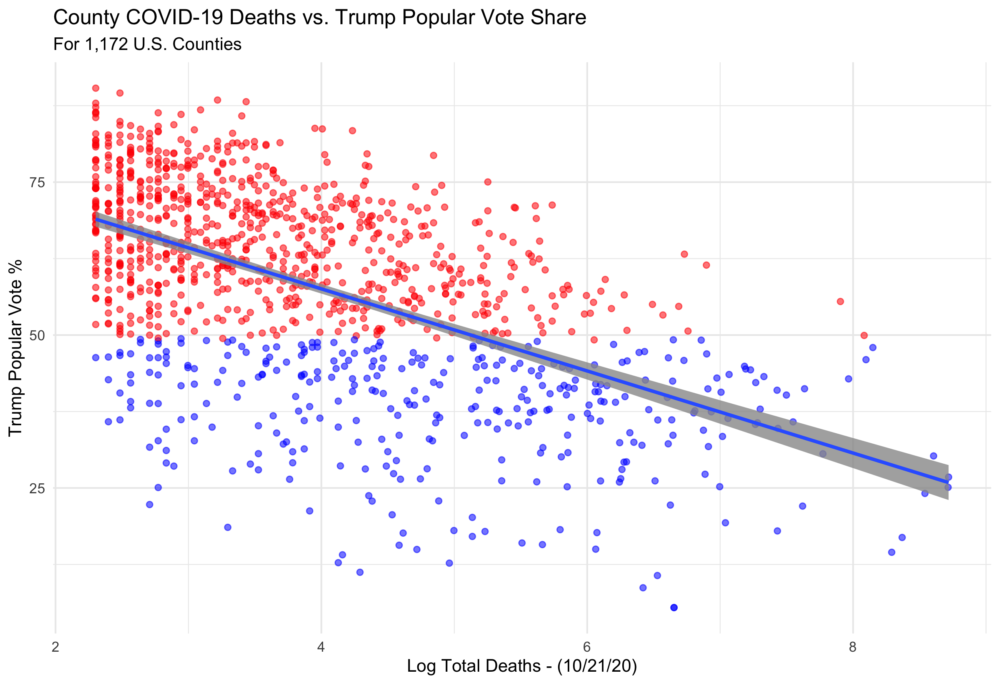

#### [Home](https://cassidybargell.github.io/election_analytics/)

# Election Narrative
## 12/10/20

## How Did COVID-19 Impact the Election and Voters?
### Media Narrative Exploration

As of December 9th 2020, COVID-19 has killed 285,351 Americans [(CDC)](https://covid.cdc.gov/covid-data-tracker/#cases_casesper100klast7days). On election day alone there were 1,130 COVID-19 deaths recorded in the U.S. The pandemic has been devastating, and has impacted nearly every aspect of life, including the 2020 Presidential Election. From the increase in mail-in ballot use, to Trump contracting the virus himself and refusing a virtual second debate, COVID-19 has had several direct impacts on the election process.

Now that the election has concluded and Biden has been declared President-Elect, there has been more speculation on the larger impact the virus might have had on the election. How did the virus influence voters in their decision on which candidate to vote for? Did COVID-19 help Biden win, or did it have less of an impact on voters than one might expect given the severity of the pandemic? 

Several media narratives have begun to speculate on the causal effect of COVID-19 on the outcome of the election. A [USA Today](https://www.usatoday.com/story/news/politics/elections/2020/11/09/covid-19-shaped-2020-election-amid-split-biden-trump-response/3729201001/) headline claimed COVID-19 "[swung] some voters to Biden but [bolstered] Trump with his base". [The Washington Post](https://www-washingtonpost-com.ezp-prod1.hul.harvard.edu/elections/interactive/2020/trump-pandemic-coronavirus-election/ions/interactive/2020/trump-pandemic-coronavirus-election/) has published an article on why "Trump's erratic behavior and failure on coronavirus doomed his reelection". [The Guardian](https://www.theguardian.com/world/2020/nov/04/exit-polls-economy-covid-lockdown-trump) noted that "Fears about the economy under lockdown helped Trump outperform [the] polls", and [Time Magazine](https://time.com/5910256/covid-19-presidential-election-outcome/) pointed out a potential paradox, that "Where the virus was the worst, voters supported Trump the most".

Understanding the true causal impact the virus had voter decision making is beyond the scope of this blog post, there are some testable implications of the claims being made by the media about the effect COVID-19 had on the election outcome. *If the virus was worst where Trump had the most support, then we would expect to see a positive correlation between deaths (either in total or per capita) and popular vote share for Trump*. This claim can begin to be examined using county level data about voting outcomes and COVID-19 death totals (as of 10/21/20) for 1,172 U.S. counties. 

When the log* of total deaths is plotted versus percentage of popular vote share for Trump in counties, a negative relationship is observed instead.

When per capita death tolls are examined rather than total death tolls, the negative relationship is significantly weakened. 

I believe the difference in these graphs is reflective of the urban-rural partisan divide. Although there are more total deaths in larger, urban, Democratic-leaning areas, per capita death rates take into account population sizes, and therefore are more useful when comparing between populations. 

if Trump gained in places where there were more coronavirus cases, we would expect the places with the largest shifts towards trump to have the highest number of deaths/per capita. If not might be better to frame as more of a partisan issue. 

https://www.usatoday.com/story/news/politics/elections/2020/11/09/covid-19-shaped-2020-election-amid-split-biden-trump-response/3729201001/

https://www-washingtonpost-com.ezp-prod1.hul.harvard.edu/elections/interactive/2020/trump-pandemic-coronavirus-election/ions/interactive/2020/trump-pandemic-coronavirus-election/

https://www.theguardian.com/world/2020/nov/04/exit-polls-economy-covid-lockdown-trump

https://time.com/5910256/covid-19-presidential-election-outcome/

* Using the log of deaths and per capita deaths in order to make data more visible despite skew of outliers.