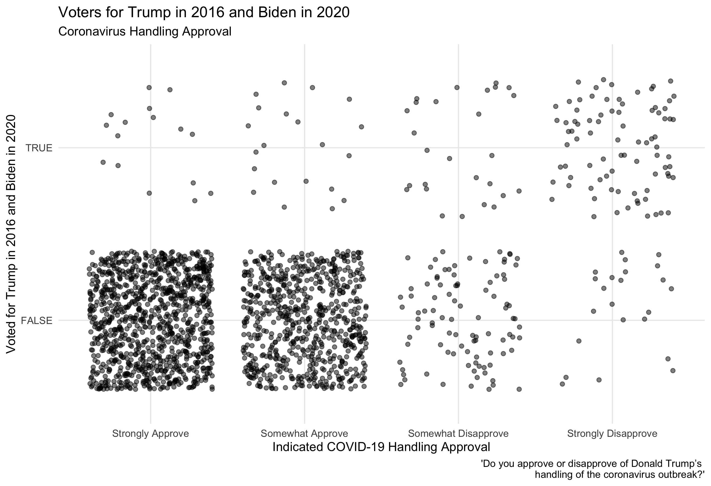

#### [Home](https://cassidybargell.github.io/election_analytics/)

# Election Narrative
## 12/10/20

## How Did COVID-19 Impact the Election and Voters?
### Media Narrative Exploration

As of December 9th 2020, COVID-19 has killed 285,351 Americans [(CDC)](https://covid.cdc.gov/covid-data-tracker/#cases_casesper100klast7days). On election day alone there were 1,130 COVID-19 deaths recorded in the U.S. The pandemic has been devastating, and has impacted nearly every aspect of life, including the 2020 Presidential Election. From the increase in mail-in ballot use, to Trump contracting the virus himself and refusing a virtual second debate, COVID-19 has had several direct impacts on the election process.

Now that the election has concluded and Biden has been declared President-Elect, there has been more speculation on the larger impact the virus might have had on the election. How did the virus influence voters in their desision on which candidate to vote for? Did COVID-19 help Biden win, or did it have less of an impact on voters than one might expect given the severity of the pandemic? 

if Trump gained in places where there were more coronavirus cases, we would expect the places with the largest shifts towards trump to have the highest number of deaths/per capita. If not might be better to frame as more of a partisan issue. 

https://www.usatoday.com/story/news/politics/elections/2020/11/09/covid-19-shaped-2020-election-amid-split-biden-trump-response/3729201001/

https://www-washingtonpost-com.ezp-prod1.hul.harvard.edu/elections/interactive/2020/trump-pandemic-coronavirus-election/ions/interactive/2020/trump-pandemic-coronavirus-election/