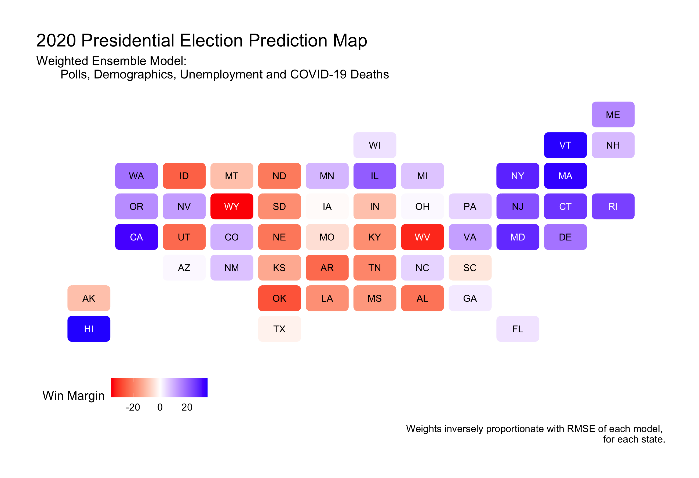
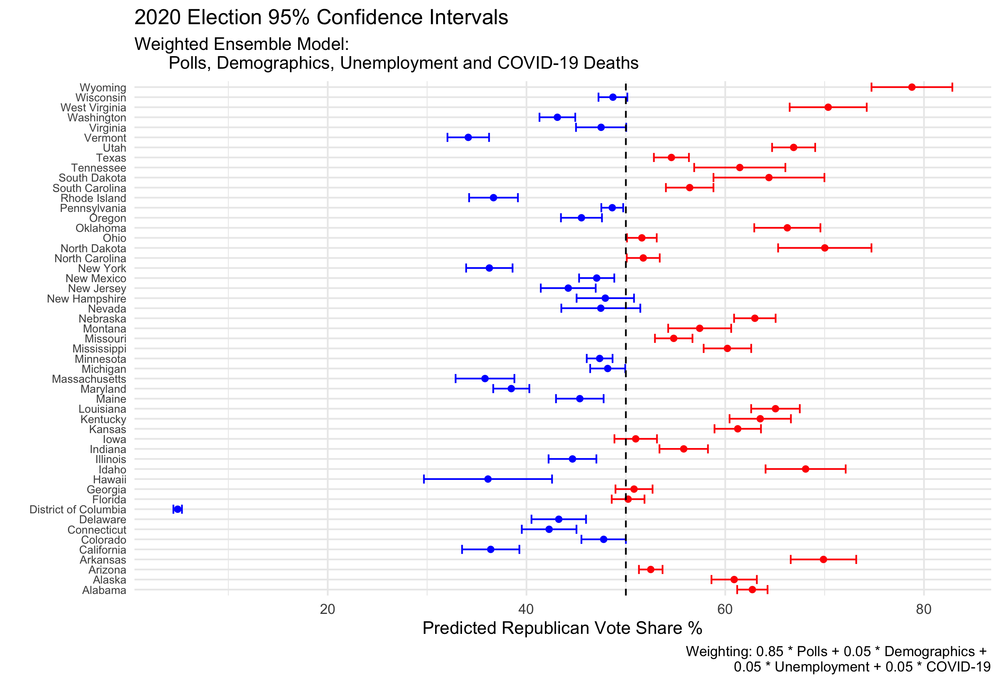
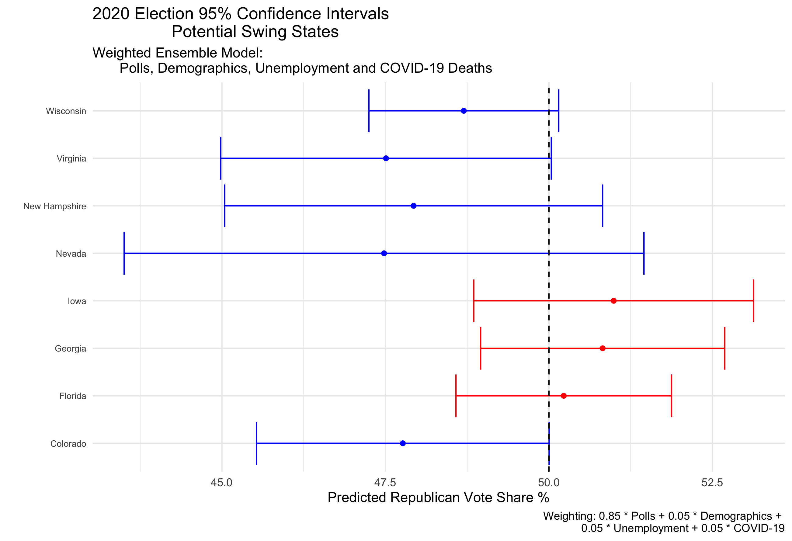
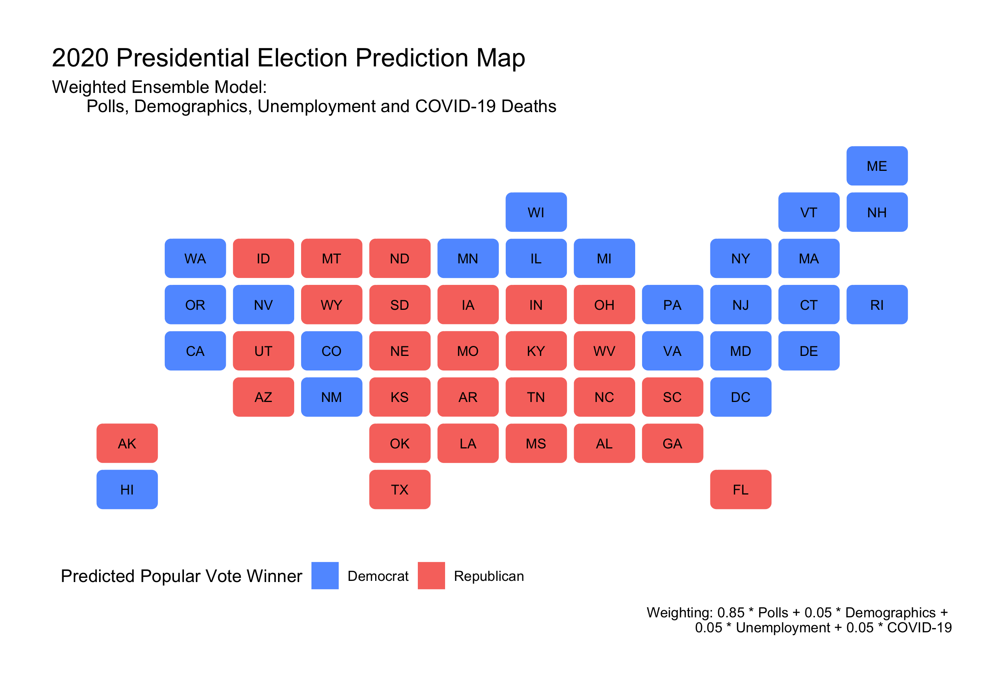

#### [Home](https://cassidybargell.github.io/election_analytics/)

# Final Election Prediction
## 11/1/20

### The Model

For my final election prediction I have chosen to use a **weighted ensemble** that combines generalized linear models based off of data from polls, demographics, unemployment rates, and COVID-19 deaths.

The individual models that make up the weighted ensemble are as follows: 

* **Polling**: Historical Republican two-party popular vote share versus state polling averages one week out or less from the election. (1972-2016) Poll averages from 10/29/20 were used to make a prediction for 2020. 

* **Demographics**: Historical Republican two-party popular vote share versus percentage of white people in the state.(1990-2016) White percentage by state in 2018 was used in the prediction for 2020.

* **Unemployment Rates**: Historical Republican two-party popular vote share versus state unemployment rates from Q2 of the election year. (1976-2016) 2020 Q2 state unemployment rates were used for the 2020 prediction.

* **COVID-19 Deaths**: Incumbent support represented directly by poll support versus 7-day COVID-19 death rates. Seven day death rate by state from 10/18/20 was used for the 2020 prediction.

[justify why these models in my ensemble, coefficients]

### Weighting the Models
 - RMSE vs arbitrary 

#### Weight by Root Mean Squared Error

#### Choice in Weights

### Prediction Interval

Confidence intervals

### Final Point Estimate of Electoral College

