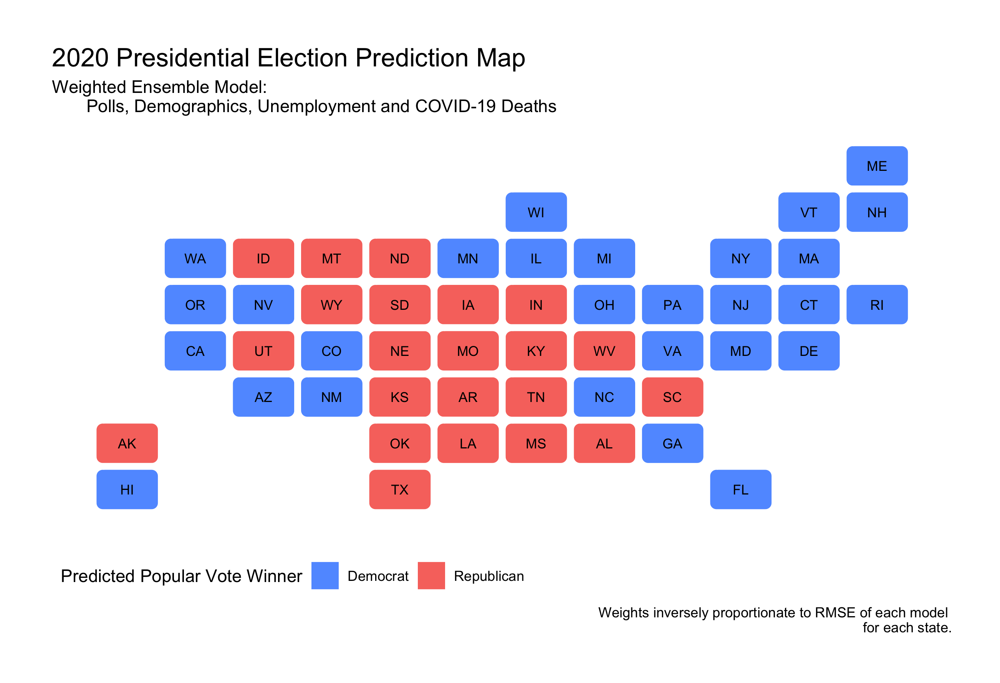

#### [Home](https://cassidybargell.github.io/election_analytics/)

# Final Election Prediction
## 11/1/20

## The Model

For my final election prediction I have chosen to use a **weighted ensemble** that combines generalized linear models based off of data from polls, demographics, unemployment rates, and COVID-19 deaths.

The individual models that make up the weighted ensemble are as follows: 

* **Polling**: Historical Republican two-party popular vote share versus state polling averages one week out or less from the election. (1972-2016) Poll averages from 10/29/20 were used to make a prediction for 2020. 

* **Demographics**: Historical Republican two-party popular vote share versus percentage of white people in the state.(1992-2016) White percentage by state in 2018 was used in the prediction for 2020.

* **Unemployment Rates**: Historical Republican two-party popular vote share versus state unemployment rates from Q2 of the election year. (1976-2016) 2020 Q2 state unemployment rates were used for the 2020 prediction.

* **COVID-19 Deaths**: Incumbent support represented directly by poll support versus 7-day COVID-19 death rate per 100,000. Seven day death rate by state from 10/18/20 was used for the 2020 prediction.

The final weighted ensemble is: 

#### **Predicted Incumbent Vote Share** = (*pwt* * Poll-Model) + (*ewt* * Unemploy-Model) + (*dwt* * Demographic-Model) + (*cwt* * COVID-Model)

Where *pwt*, *ewt*, *dwt*, and *cwt* are weights assigned to each model. The heavier a model is weighted, the more influence it has over the final prediction produced by the model. 

Below is the distribution of coefficients for each state included in the final ensemble.

Positive coefficients suggest a positive relationship between independent variable and predicted voteshare, and the opposite is true for negative coefficients. Therefore the coefficients can be interpretted as follows: 

* *COVID-19 Deaths*: the change in predicted vote share for the incumbent party (modelled directly with polling data) for a 1% increase in 7-day COVID-19 death rate per 100,000
* *Demographics*: the change in predicted vote share for the Republican party for a 1% increase in white population in a state
* *Unemployment*: the change in predicted vote share for the Republican party for a 1% increase in Q2 unemployment rate 
* *Polls*: the change in predicted vote share for the Republican party for a 1 point increase in the polls (adjusted poll aggregates - [538](https://projects.fivethirtyeight.com/polls/))

The outlier in demographic coefficients is West Virginia, a solidly red state. This is because the white population in West Virginia has steadily declined since 1992, from ~96% to ~94%, while the state has become increasingly Republican. This is not overly informative about the demographic inindependent variable, but rather reflects the rapid increase in vote share the the Republican party experienced in West Virginia; from recieving ~42% in 1992, to ~72% in 2016. 

**Why include these variables in the weighted ensemble?**

I have explored each of these variables in previous weeks, and believe the combination has the potential to accurately capture the complexities of the 2020 election. 

* **Polling**: Polls provide direct insight into voter preferences. Given how unpredictable other variables have been in 2020, I believe polling is essential to create a prediction model this year. As the election date approaches, there is also an uptick in the amount of polls coming from states so polling becomes less variable the closer to the election. 

* **Demographics**: Demographics can also be useful in predicting election outcomes. I have chosen to include white percentage as a predictor for Republican vote share because of the criticisms of 2016 polls having a generally left-leaning bias [(Economist)](https://projects.economist.com/us-2020-forecast/president/how-this-works). In theory including demographic data would increase the stability of the model for 2020 (the pandemic has not drastically altered demographic makeup of states), while also perhaps balancing any potential skewed polling bias that might not yet be detectable. 

* **Unemployment Rates**: Unemployment is the only economic fundamental I have chosen to include in the weighted ensemble. Although nearly every economic indicator crashed in 2020, unemployment may have the most direct impact on individuals, and therefore might have the largest effect on retrospective voting evaluating the incumbent administration. As will be explored in the weighting of the ensemble, unemployment is given a small weight to reflect the potential lack of predictive power economic models have in such an unprecedented year. 

* **COVID-19 Deaths**: The pandemic has been a central theme of this years election as it has massively disrupted life for nearly every American. I think failing to include it in the model would ignore a massive variable in 2020. In theory [casualty sensitivity](https://www-journals-uchicago-edu.ezp-prod1.hul.harvard.edu/doi/pdfplus/10.1111%2Fj.1468-2508.2007.00564.x) would impact support for the incumbent. There is no historical data that can be used to model the effect of the pandemic however, so poll support throughout 2020 is being used as a direct proxy to understand how a second wave near the election could change vote share. 

## Weighting the Models

I explored two ways to weight the models in the ensemble. One method was weighting was based on the root mean squared errors of each generalized linear model. The other was a somewhat arbitrary choice in weights. The weighting options are explained further below. 

### Choice Weights

The first way I chose to weight the models was somewhat arbitrary, however represents what I think logically should recieve the most weighting in the model. Given that the polling data being used is from 1 week or less out from the election, the polls should be less variable and in turn more predictive of the actual election outcome. Nate Silver, for example, weights his model almost entirely on polls the closer to election day it gets [(538)](https://fivethirtyeight.com/features/how-fivethirtyeights-2020-presidential-forecast-works-and-whats-different-because-of-covid-19/).

For this reason, I weighted polls most heavily at **0.85**, and weighted the rest of the models equally at **0.05**. 

This choice of weights predicts a Biden win with **279** electoral college votes over Trump's **259**. This is the same model predicted using only polling data (1 weight for polls, 0 weight for the other variables).

If all models are weighted equally at 0.25, the ensemble predicts a Biden win with 323 electoral college votes over Trump's 215. When any of the other variables are weighted the most heavily at 0.85, only the unemployment model predicts a Trump electoral college victory with 304 votes over Biden at 234. COVID-19 death data on the other hand provides the most extreme prediction at a Biden win with 418 electoral college votes. 

The variations of the weighted ensemble using simple choice in weights are below: 

**Predicted Trump Electoral College Votes** = (*0.85* * Poll-Model) + (*0.05* * Unemploy-Model) + (*0.05* * Demographic-Model) + (*0.05* * COVID-Model) = **259**

**Predicted Trump Electoral College Votes** = (*0.25* * Poll-Model) + (*0.25* * Unemploy-Model) + (*0.25* * Demographic-Model) + (*0.25* * COVID-Model) = **215**

**Predicted Treump Electoral College Votes** = (*0.05* * Poll-Model) + (*0.85* * Unemploy-Model) + (*0.05* * Demographic-Model) + (*0.05* * COVID-Model) = **304**

**Predicted Trump Electoral College Votes** = (*0.05* * Poll-Model) + (*0.05* * Unemploy-Model) + (*0.85* * Demographic-Model) + (*0.05* * COVID-Model) = **230**

**Predicted Trump Electoral College Votes** = (*0.05* * Poll-Model) + (*0.05* * Unemploy-Model) + (*0.05* * Demographic-Model) + (*0.85* * COVID-Model) = **120**

### Weight by Root Mean Squared Error

The second way I have weighted the models uses root mean square errors (RMSE). RMSE is a measure of the differences between the values predicted by a model and the true values, or a measure of the in-sample performance of each model. The smaller the RMSE, the more predictive that model has historically performed.

I have therefore weighted the models individually for each state. The weights are inversely proportional to the models' RMSE. If a models' RMSE was higher in comparison to the other models for that state, it was weighted less, and if a model had a relatively lower RMSE, it was weighted more heavily in that states weighted ensemble. This method allows for dynamic weighting based on state.

The distribution of RMSEs is visualized below. Choice weights represents the weighted total RMSE produced by the ensembles with polls weighted at 0.85. RMSE-Weights is the weighted total RMSE produced by using each models RMSE value for varying weights by state. 

COVID-19 death models generally have the lowest RMSE values, whereas the economic data generally has higher RMSE values. Therefore, in the RMSE weighted ensemble COVID-19 deaths are generally weighed more heavily than economic data. 

The weighted total RMSE for each state is also lower using the RMSE weights rather than the Choice weights. This would suggest the ensembles modelled using RMSE values for weights have lower root mean square errors than the ensembles modelled weighing polls most heavily.

*Note D.C. is not modelled but is assumed to be a guaranteed Democrat win.*

Using the RMSE weighted ensemble, it predicts a more secure Biden win with **368** electoral college votes, and Trump with **170**.

I believe the initial choice weighted ensemble (polls at 0.85), and the RMSE-weighted model provide the most promising prediction outcomes, so those two will be explored further below. 

## Prediction Interval

For these two models I have constructed a 95% confidence interval for predicted vote share in each state. 

For the choice weighted ensemble, there are 8 states whose confidence intervals include the 50% vote share mark. They are **Wisconsin, Virginia, New Hampshire, Nevada, Iowa, Georgia, Florida and Colorado**. In this prediction model electoral college votes are determined by winning above 50% of the popular vote share. So, within the 95% confidence interval these states are most likely to "flip" from their predicted party winner to the other. 

To illustrate this point, a prediction interval can be created using the upper and lower bounds of the confidence intervals. In the choice weighted ensemble, this means that for the lower bound of the prediction interval, Iowa, Georgia and Florida flip blue. The opposite would happen for the upper bound of the prediction interval.   

For my choice weighted ensemble, the prediction interval for Trump electoral college votes would range from **208 to 301**. (For Biden this would translate to **330 to 237**). 

This means that within my 95% confidence intervals there is a path for Trump to win, however it would require flipping states currently projected to vote blue. 

A prediction interval can also be constructed for the RMSE-weighted ensemble using 95% confidence intervals for each state. 

Seven states from this model have confidence intervals that include the 50% vote share tipping point. They are **Wisconsin, Texas, Ohio, Iowa, Georgia, Florida and Arizona**. 

The prediction interval for Trump from this model is constructed in the same way, using the lower and upper bounds of state confidence intervals which in turn flips these potential swing states one way or another. The prediction interval for Trump electoral college votes would therefore range from **126 to 254**. For Biden this would be from **284 to 412**. Although this suggests that a Trump win would be highly unlikely, because 95% confidence intervals are used, a Trump win is definitely not impossible. 

## Final Point Estimate of Electoral College

Exploring both of these weighted ensembles has been helpful in understanding what factors might pull the election one way or another. For my final point prediction I have chosen to use the RMSE-weighted model. Although this model predicts much more extreme Biden wins, I think that the weighting of states dynamically is valuable. I believe it better reflects how different states are influenced and predicted by differing variables more strongly. 

In that case, I would predict a **Biden victory**. With a point-estimate of **368** electoral college votes, and a prediction interval of **284 to 412**. 

In turn, I predict **Trump** to recieve **170** electoral college votes, with a prediction interval of **126 to 254**.

