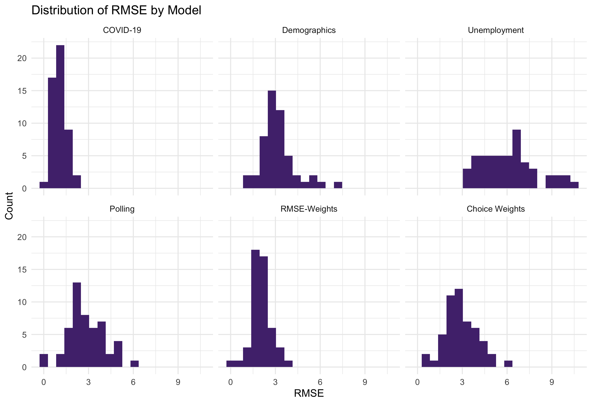
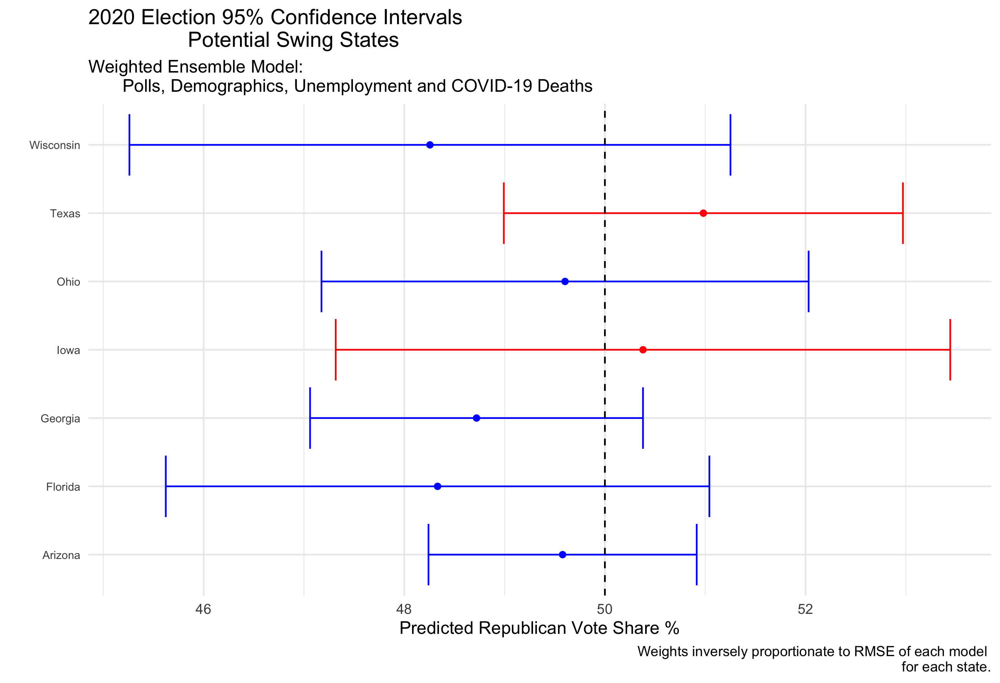

#### [Home](https://cassidybargell.github.io/election_analytics/)

# Final Election Prediction
## 11/1/20

## The Model

For my final election prediction I have chosen to use a **weighted ensemble** that combines generalized linear models based off of data from polls, demographics, unemployment rates, and COVID-19 deaths.

The individual models that make up the weighted ensemble are as follows: 

* **Polling**: Historical Republican two-party popular vote share versus state polling averages one week out or less from the election. (1972-2016) Poll averages from 10/29/20 were used to make a prediction for 2020. 

* **Demographics**: Historical Republican two-party popular vote share versus percentage of white people in the state.(1992-2016) White percentage by state in 2018 was used in the prediction for 2020.

* **Unemployment Rates**: Historical Republican two-party popular vote share versus state unemployment rates from Q2 of the election year. (1976-2016) 2020 Q2 state unemployment rates were used for the 2020 prediction.

* **COVID-19 Deaths**: Incumbent support represented directly by poll support versus 7-day COVID-19 death rate per 100,000. Seven day death rate by state from 10/18/20 was used for the 2020 prediction.

The final weighted ensemble is: 

##### **Predicted Incumbent Vote Share** = (*pwt* * Poll-Model) + (*ewt* * Unemploy-Model) + (*dwt* * Demographic-Model) + (*cwt* * COVID-Model)

Where *pwt*, *ewt*, *dwt*, and *cwt* are weights assigned to each model. The heavier a model is weighted, the more influence it has over the final prediction produced by the model. 

Below is the distribution of coefficients for each state included in the final ensemble.

Positive coefficients suggest a positive relationship between independent variable and predicted voteshare, and the opposite is true for negative coefficients. Therefore the coefficients can be interpretted as follows: 

* *COVID-19 Deaths*: the change in predicted vote share for the incumbent party (modelled directly with polling data) for a 1% increase in 7-day COVID-19 death rate per 100,000
* *Demographics*: the change in predicted vote share for the Republican party for a 1% increase in white population in a state
* *Unemployment*: the change in predicted vote share for the Republican party for a 1% increase in Q2 unemployment rate 
* *Polls*: the change in predicted vote share for the Republican party for a 1 point increase in the polls

The outlier in demographic coefficients is West Virginia, a solidly red state. This is because the white population in West Virginia has steadily declined since 1992, from ~96% to ~94%, while the state has become increasingly Republican. This is not overly informative about the demographic inindependent variable, but rather reflects the rapid increase in vote share the the Republican party experienced in West Virginia; from recieving ~42% in 1992, to ~72% in 2016. 

**Why include these variables in the weighted ensemble?**

## Weighting the Models

sensitivity analysis 
 - RMSE vs arbitrary 

### Weight by Root Mean Squared Error

### Choice in Weights

## Prediction Interval

Confidence intervals

## Final Point Estimate of Electoral College

