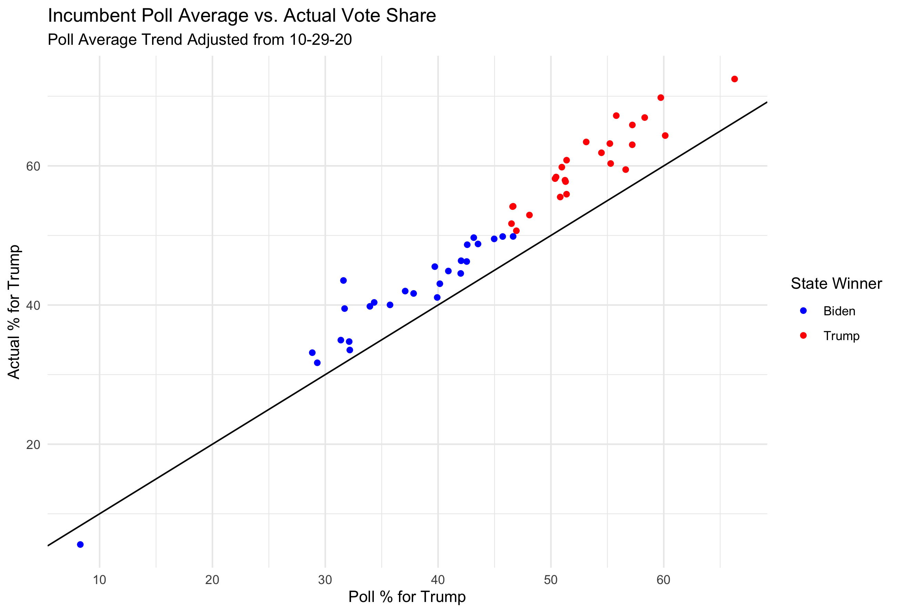

#### [Home](https://cassidybargell.github.io/election_analytics/)

# Post Election Reflection
## 11/25/20

## How My Model Performed 

My final prediction model was a [**weighted ensemble**](https://cassidybargell.github.io/election_analytics/posts/final_prediction.html) that combined generalized linear models based off of data from polls, demographics, unemployment rates, and COVID-19 deaths. I settled on using weights for each state that were inversely proportionate to the RMSE of each individual model in the weighted ensemble. This meant for the majority of states the COVID-19 7-day death rate model was weighted most heavily, and the unemployment model was given the least amount of weight. 

#### **Predicted Incumbent Vote Share** = (*pwt* * Poll-Model) + (*ewt* * Unemploy-Model) + (*dwt* * Demographic-Model) + (*cwt* * COVID-Model)

Where *pwt*, *ewt*, *dwt*, and *cwt* are weights assigned to each model. The heavier a model is weighted, the more influence it has over the final prediction produced by the model. 

The final point estimate this model produced was **368** electoral college votes to Biden and **170** to Trump. 

The final election outcome was **306** electoral college votes for Biden and **232** for Trump. I overpredicted Biden's win by 62 electoral college votes, which comes down to missing three states that went to Trump: **Florida** (29 votes), **Ohio** (18 votes), and **North Carolina** (15 votes). *(I also predicted Maine and Nebraska without split votes, but both states had one vote go to the non-majority party which was one for Biden in Nebraksa and one for Trump in Maine, so it had no final affect on the overall electoral vote count.)*

(The three states I missed are the three red points to the left of the verticle line)

States above the diagonal line are states in which I overpredicted the Biden vote share, and states under the diagonal line are where I underpredicted Biden vote share. Overall I overpredicted Biden in 41 out of 50 states, the nine states in which I overpredicted Trump vote share were Maryland, Colorado, New Mexico, Oregon, Vermont, Washington, Nebraksa, Utah, and Delaware.

*The [Choice Model](https://cassidybargell.github.io/election_analytics/posts/final_prediction.html) weighted polls most heavily at 0.85, with unemployment, demographics, and COVID-19 death rates all given a weight of 0.05.*

The difference between predicted vote share and actual vote share for Trump can be visualized below. The verticle dashed lines represent the average difference between predicted and actual values for states that went to Trump (-2.95) and states that went to Biden (-1.15).

The root mean square error for this model, a measure of how far my predicted values were from the true values, was **3.04**.

The RMSE values for the model separated by who won the state vary. For states won by Biden, the RMSE value was **2.57** whereas for states won by Trump the RMSE was **3.45**. This suggests I was more innaccurate in red states than I was in blue states.

Although I chose the RMSE weighted model in the end, I also wanted to examine how the my choice weighted model performed (polls weighted at 0.85, all other models at 0.05). The choice model more closely predicted the true outcome in 28 states, compared to the RMSE model more closely predicting the true outcome in 22. 

The RMSE model seemed to perform better predicting blue states, while the choice model seemed to perform better predicting red states. Overall however, the choice model was more accurate than the RMSE model. The choice weights model only missed 2 states, Arizona and Georgia, which were the two states with the closest final outcome of all 50 states. 

The RMSE for the choice weight model overall was lower than the RMSE weighted model, at **2.98**. When separated by red and blue states, the RMSE for blue states using the choice model was **2.84** and for red states was **3.12**. For both models it therefore seems I was **less accurate in predicting the outcome for states that went to Trump, and consistently overpredicted Biden vote share.** 

# Sources of Innaccuracy

### COVID Model
I think a large source of my underprediction of Trump's performance came from an overreliance on polling data, especially given my inclusion of the COVID-19 model. I included the COVID-19 death rate model in an attempt to represent casualty sensitivity that might decrease support for the incumbent given the pandemic. This model matched polling averages with 7 day death rates, which allowed me to create a generalized linear model that I used to predict vote share dependening on the 7-day COVID death rate directly prior to the election. 

The thought behind the inclusion of this parameter was that the general public is sensitive to casualties, and a spike in deaths that was predicted right around the election should hurt the incumbent. ([Record high cases and deaths](https://www.cbsnews.com/live-updates/covid-19-latest-news-2020-11-03/) were being reported right on and around election day.)

For the RMSE weighted model, each parameter was weighted inversely proportional to its RMSE by state. The COVID-19 model generally had the lowest RMSE, which makes sense given it was modelled off of polls from one year, so was weighted the most heavily. This model of COVID-19 deaths seemed important to include given the magnitude of the pandemic, but in retrospect I don't think that the matching of polling data with 7-day death rate was the most appropriate way to measure any potential effect of COVID deaths on the election. 

- For one, this made my prediction very poll-heavy. In 2020 the polls had a left-leaning bias, which might be a contributing factor in my consistent over-prediction of Biden vote share.

- Changes in polls reflect a response to any number of factors, not coronavirus deaths alone. COVID-19 approval ratings might have been a better source to match on, however lack of data might be a limiting factor. 
- As discussed in my post on [shocks](https://cassidybargell.github.io/election_analytics/posts/week_7.html), there might be partisan differences in perception of how the virus was handled. COVID-19 death rates might therefore impact voters in some states but not others. 

In order to test this hypothesis that COVID-19 death rates were not reflected in polling data, it would be useful to compare trends in other measures of public opinion. For example, Presidential approval ratings, or surveys that ask about approval of the handling of the virus could be modelled against COVID-19 death rates and then compared to the model using polls to see if a different type of public opinion survey better reflects casualty sensitivity. 

# If I Were to Do It Again...

- maybe use more economic factors from the prior year

