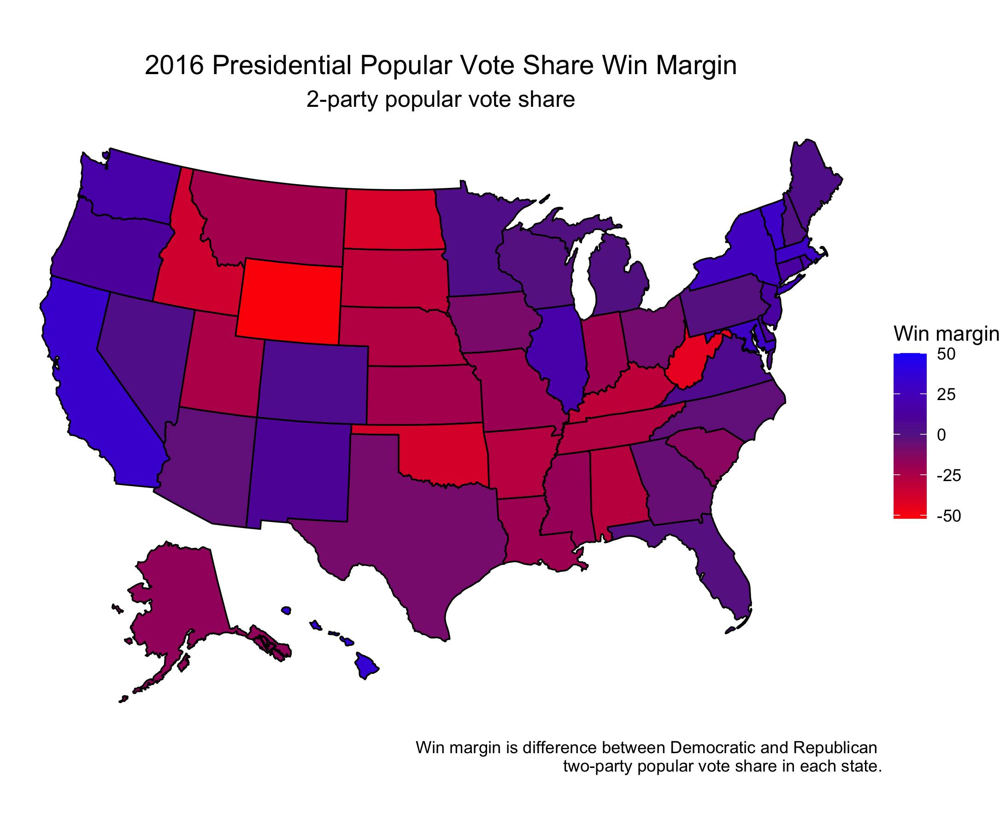
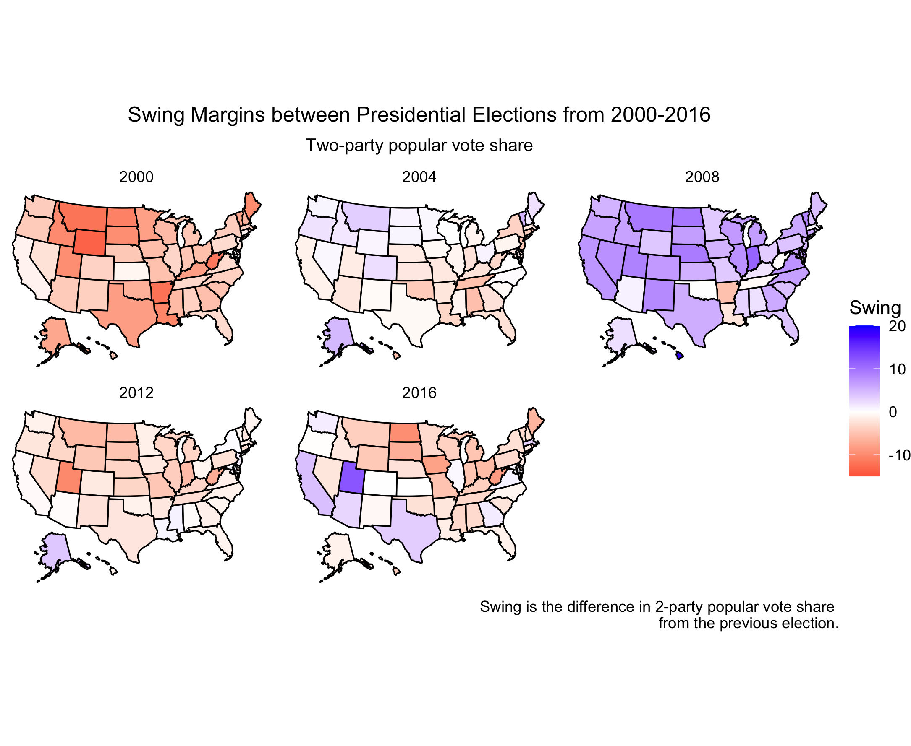
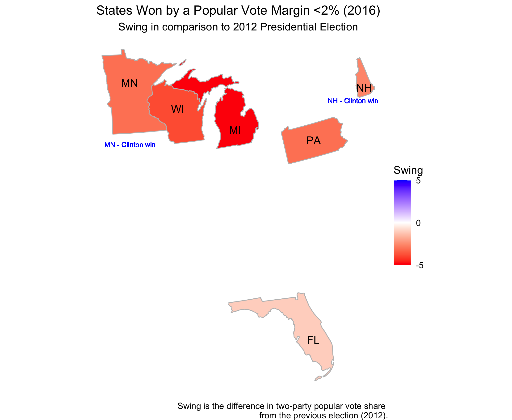

#### [Home](https://cassidybargell.github.io/election_analytics/)

# Past Presidential Elections
## 9/14/20

An understanding of the past is a critical component of being able to make predictions about the future. So, what can we learn from past elections that might inform our understanding of the upcoming 2020 election? 

The two major parties, Democratic and Republican, have been in close competition for the presidency for many election cycles. Since 1948, the win margin for the two party vote share has not exceeded 24% (the largest being in 1972 with a difference of 23.58% in favor of the Republican candidate). Three elections have been within a 1% difference: 1960 with a 0.174% advantage to the Democratic candidate, 1968 with a 0.809% advantage to the Republican candidate, and in 2000 with a 0.519% advatage to the Democratic candidate. The trend in differences between percentage split of the two party poular vote share can be visualized below:

Win margins have remained smaller in more recent elections. The last time the difference in two-party popular vote share exceeded 10% was in 1984 with the election of Republican Ronald Reagan. 

Popular vote share can also be stratified by state throughout the years: 

This figure can be slightly misleading however, as a red state does not mean 100% of the popular vote in that state went to the Republican candidate. This type of depiction might be easily confused with a map showing electoral college votes in which all votes for each state are cast for one candidate (excluding Maine and Nebraska).

Instead, we can illustrate the American presidential popular vote share as being mostly purple [(Ansolabehere, Rodden & Snyder)](https://web.stanford.edu/~jrodden/jep.20.2.pdf). Take for example the state by state win margin of two-party popular vote share in 2016:

In their paper Purple America, Ansolabehere, Rodden & Snyder consider more deeply why we can increasingly consider the ways in which America is becoming more purple. One way to attempt to visualize this trend is through swing. How much do states swing from one election year to the next? 

I have quantified swing as being the difference in Democratic vote share percentage between an election and the prior election ($Dpv_y - Dpv_{(y-4)}$) although the difference in Republican vote share could also be used ($Rpv_y - Rpv_{(y-4)}$). This means swing is the difference in percentage of popular vote cast for either party (postive is towards the left, negative is towards the right, again arbitrary).

This shows that there seems to be a lot of swing between popular vote in many states between elections. Although states swing one direction or another, this does not mean the winner of the popular vote changes (take for example Utah in 2016). 

If all states swing a little, in which states does the swing matter? Swing or battleground states can be classified many different ways, but are typically thought of as states in which the popular vote winner could go either way.

Even among what Ansolabehere, Rodden & Snyder consider to be "regularly Republican" and "regularly Democratic" states, the typical win margin is still relatively small (8 points). Based off that value, in this example I will somewhat arbitrarily consider a close popular vote share election one with a win margin of less than or equal to 2%. Only six states in the 2016 election fit this description:

These states are often included in discussions around which states were 2016 battlegrounds [(Washington Post)](https://www-washingtonpost-com.ezp-prod1.hul.harvard.edu/graphics/politics/2016-election/swing-state-margins/). 

All of these six states swung right in the 2016 election. The Minnesota and New Hampshire electoral votes still went to the Democratic candidate as they did in 2012. Michigan, Pennsylvannia, Florida and Wisconsin, however, all switched to voting for the Republican candidate in 2016 after having voted for the Democratic party in 2012. 

In 2016 there were also only six states whose swing value was larger than the margin by which the popular vote as won. Five of the states won by a popular vote margin <2% (MN, WI, MI, PA, NH) and Maine. 

Although America is purple in regards to popular vote in every state, observing trends in these new and historical swing states has large implications for the outcomes of the electoral college which ultimately decides the election.  

