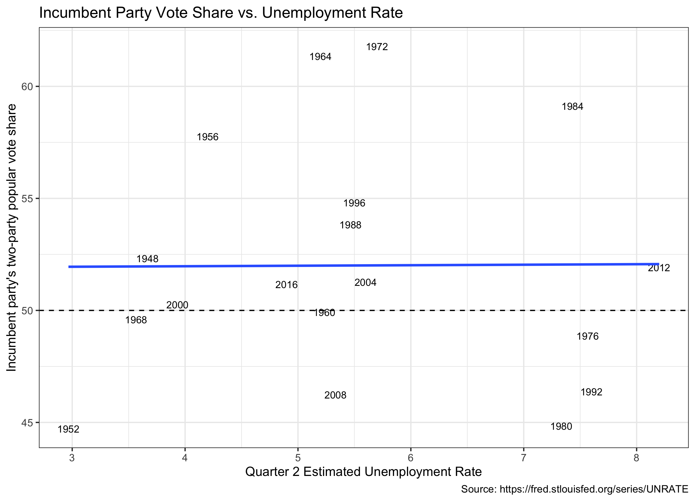
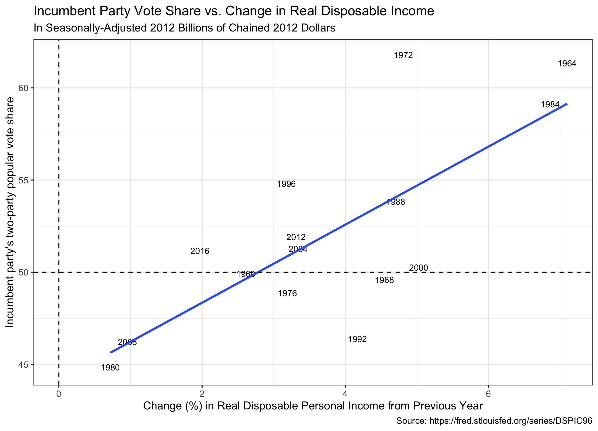

#### [Home](https://cassidybargell.github.io/election_analytics/)

# Economic Fundamentals 
## 9/21/20

Quarter 2 GDP Predict: 21.3% pv2p for Trump
mean outsample error: 1.7833
2019 Quarter 4 GDP Predict: 51.2

(2017-2019 annual GDP avergae)Yearly Predict: 50.7
mean outsample error: 1.8124

Unemploy predict: 52.2
mean outsample error: 2.139

RDPI predict: 58
mean outsample error: 1.6620

Inflate predict: 53.6
mean outsample error: 2.258

WI: 58.03, MI: 63.43, PA: 54. 74, GA: 40.69, OH 60.85

WI = rsquared 0.250, MI = rsquared 0.258, PA = rsquared 0.147, GA = rsquared 0.2406, OH = rsquared 0.1721