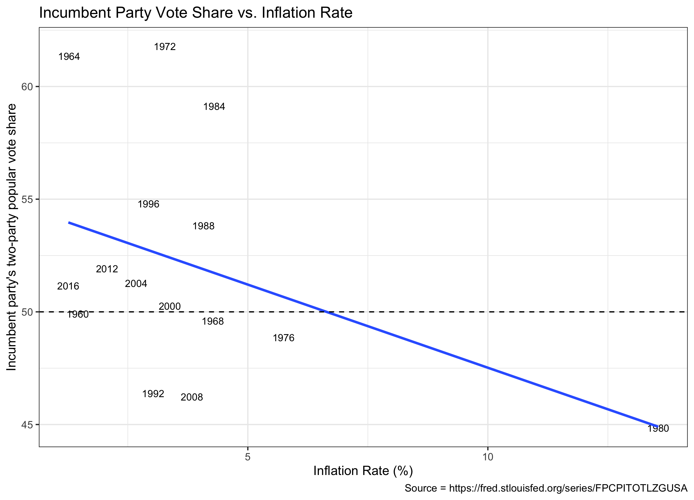

#### [Home](https://cassidybargell.github.io/election_analytics/)

# Economic Fundamentals 
## 9/21/20

The state of the economy is considered one of the fundamentals of elections. Economic factors are considered fundamental because they are not directly controlled by candidates, unlike for example campaign strategies [(Sides and Vavreck)](https://muse-jhu-edu.ezp-prod1.hul.harvard.edu/book/64467). 
 
Economic variables can also act as a proxy for many other factors a voter might care about when they go to the polls. Compared to other issues that might not be as readily quantifiable, economic information is generally accessible. Economic variables are therefore useful for creating predictive models for elections. **How well will these economic predictive models work for the 2020 election in which there has been an unprecedented economic downturn due to the global pandemic?**

During an election, an incumbent will generally be rewarded or punished by American voters for percieved performance, this concept is based on the retrospective theory of political accountability [(Achen and Bartels)](https://muse-jhu-edu.ezp-prod1.hul.harvard.edu/book/64646). The end-heuristic model of voter behavior also supports the idea that people will substitue end conditions for an assessment of the whole period [(Healy and Lenz)](https://www-jstor-org.ezp-prod1.hul.harvard.edu/stable/24363467?seq=1#metadata_info_tab_contents). Despite intention to weigh all years of an incumbents performance equally, cumulative performance information is not generally as available and would require serious effort from individual voters to accurately compute [(Healy and Lenz)](https://www-jstor-org.ezp-prod1.hul.harvard.edu/stable/24363467?seq=1#metadata_info_tab_contents). 

Therefore, I will focus on election year GDP to build an initial predictive model for 2020. Using historical data from past presidential election years, the linear model between quarter GDP growth rate and incumbent share of two-party popular vote can be visuallized with the following model:

Although Q3 provides the strongest correlation for election prediction, data for the election year Q3 GDP is often not available until close to the election itself, so Q2 GDP  is often the choice for predictive modelling, and will be what I focus on. 

Using the Q2 linear model, two-party popular vote share (pv2p) for the incumbent can be estimated with the following equation `pv2p_{predicted} = 49.449 + 2.969 * GDP_{Q2}`. This can be interpretted as, if the GDP growth was 0 we would expect a vote share of *49.449%* for the incumbent. For every 1% change in the quarter GDP growth we would expect an increase of *2.969%* popular vote share for the incumbent. 

The t-values for both the intercept (49.449) and the slope (2.969) are 35.425 and 2.783, respectively. With both t-values > 2 is is unlikely this is a random correlation.* 
The mean out-sampled error for the Q2-GDP predictive model, leaving out 8 years of data and iterating 1,000 times, was 1.7833.*

Using this Q2 predictive model and the 2020 Q2 GDP, we would predict a 21.3% vote share for the incumbent, an unparalleled defeat for Donald Trump. This estimate, however does not seem reasonable as it would be the lowest vote share by over 15 percentage points in the post-war (1948) era.

The data used for this prediction was the 2020 Q2 GDP, which was historically low and not representative of the economic trends from the pre-COVID-19 Trump term. Using the same Q2 predictive model with the 2019 Q4 GDP before the shock of the pandemic would give an estimate of 51.2% popular vote share for the incumbent, actually predicting a win for Trump. Using an average of all the quarters before 2020, the same model would predict 51.3% of the two-party vote share going to Trump. 

A similar model of linear regression can be constructed using the entire election year GDP, `pv2p_{prediction} = 47.6993 + 1.2015 * GDP_{year}`, t-values of 45.347 (intercept) and 4.74 (slope), and a mean out-sample error of 1.8124. If the average of the 2017-2019 GDPs (before coronavirus shock, and more robust than one quarter) is used as an estimate for an evaluation of the economy under the incumbent, there would be a predicted 50.7% slim win margin for Trump. 

Using the GDP as a predictor for the 2020 election does not seem to carry much weight, despite the historical strength of the models, because of the economic shock of COVID-19. 

Other economic variables, however, should also be evaluated for potential value in predicting the 2020 election. Unemployment rates can be another proxy for economic strength, and might actually be a more salient problem for the general population than the GDP.

The linear model using historical unemployment rates (unrate) [(FRED)](https://fred.stlouisfed.org/series/UNRATE), is `pv2p_{predict} = 51.881 + 0.022 * unrate_{2020}`. The t-value for the slope in this model is 0.027, and the slope is very close to 0, so I would not consider this particular model to hold any real predictive power. (The estimate is provides is *52.2%* of popular vote share for the incumbent with an mean outsampled error of 2.139). 

Inflation is another economic indicator that might be useful for prediction. Using historical yearly inflation rates, the linear model relating inflation and two-party popular vote share is visuallized below [(FRED)](https://fred.stlouisfed.org/series/FPCPITOTLZGUSA). 

The linear regression in this model is `pv2p_{predict} = 54.8986 + -0.74 * inflation_{2019}`, which predicts Trump would recieve *53.6%* of the two-party popular vote share. The model, however, has a a mean outsampled error of 2.3 and a t-value < 2 for the slope. Similar to the conclusion drawn from unemployment rates, I have little confidence in the accuracy of this model. 

Real personal disposable income (RDPI) is an interesting economic principle to consider during the pandemic as many people's disposable income went up even as other economic factors, like the GDP tanked. As you can see this economic variable also provides a strong predictive model:

The linear model using RDPI  is `pv2p_{predict} = 51.881 + 0.022 * rdpi_{2020}` [(FRED)](https://fred.stlouisfed.org/series/DSPIC96). The t-values for the intercept and slope in this model are 20.172 and 4.036, respectively. The mean outsampled error is 1.7. This model therefore seeems to have strong predictive value. 

Using the available data for RDPI in 2020 (January-July), this model predicts *58%* of the two-party popular vote going to the incumbent. 

Out of these four models representing the relationship between an economic variable and popular vote share, only Q2 GDP and RDPI show promise of being valuable for prediction. Using those two models, however, we find a discrepency between predictions of *36.7* percentage points (58 - 21.3). Given the unique circumstances of 2020 it is unlikely either of those predictions will be extremely accurate.

Another way to use economic data for election predictions is to stratify by state.

The relationship between state economies and two-party vote share for the Republican party can be modelled using Q2 state unemployment data.

I have chosen to show the models for eleven states that are being included in various discussions about 2020 swing states (including my swing state model from [9/14/20](https://cassidybargell.github.io/election_analytics/posts/week_1.html))) [(NPR)](https://www.npr.org/2020/09/16/912004173/2020-electoral-map-ratings-landscape-tightens-some-but-biden-is-still-ahead).

Just as unemployment data was not overly useful in prediction on the national level, only a few states produce models that are significant enough to focus on. These are Wisconsin, Michigan, Pennsylvania, Georgia and Ohio. None of these state models produce t-values for slope >= 2, so their predictive power is still limited. 

Based on 2020 Q2 unemployment rates, the predictions of Republican vote share in these five states are as follows: 

WI: *58.03%*, MI: *63.43%*, PA: *54.74%*, GA: *40.69%*, and OH *60.85%*.*

Although these predictions do not hold much weight, if this outcome came true this would add up to 64 electoral college votes for Trump and 16 for Biden for this particular subset of swing states. 

The economic downturn of 2020 cannot be entirely attributed to Trump's administration. Achen and Bartels discuss how voters consider an element of randomness in their evaluation of an incumbents economy [(Achen and Bartels)](https://muse-jhu-edu.ezp-prod1.hul.harvard.edu/book/64646). Based on economic numbers alone it is not clear how much of the 2020 economy voters will attribute to randomness. The placement of blame for the pandemic economy might have a strong impact on the outcome of the election. 

**It is clear, however, from the examples explored above that normal predictive economic models might not hold as much prediction power for the 2020 election as they perhaps have in previous elections.**

**A t-value close to zero would indicate that the correlation modelled might be due to random chance. An absolute t-value of > 2 is often used as a minimum in order to reject the null hypothesis, which is that there is no true correlation between the variables.*

**The mean outsampled error is found by taking the average difference between the estimates created by the model and the true outcomes. This is done by leaving out 8 elections from the data, modelling it, and then comparing the subsequent predictions produced with the true values. This is repeated 1,000 times, and then the overall average is found. It is ideal to have a small outsample error as it indicates the model fits the data well.*

**Additional statistical tests for these values can be found on the github for the blog.*