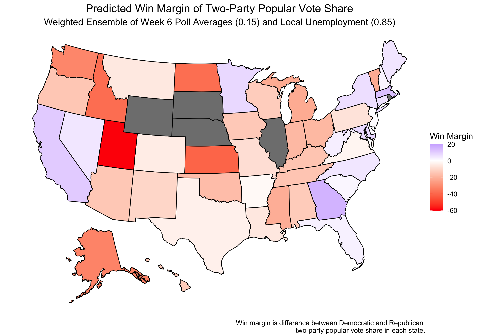
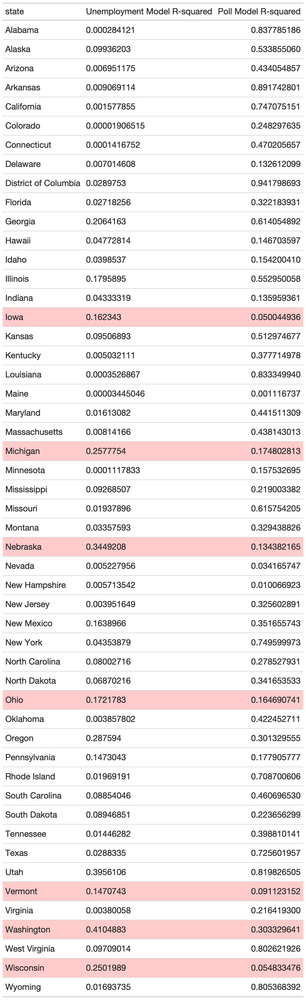

#### [Home](https://cassidybargell.github.io/election_analytics/)

# Polls
## 9/28/20

Although fundamentals, like the economy, have historically been useful for election prediction, polls provide more direct insight into voter preferences that might not be captured by fundamentals alone. Given the unprecedented economic circumstances of 2020, polling is all the more necessary as we cannot rely on fundamentals alone. How can both voter preferences identified through polling and economic fundamentals be combined to create a predictive model?

First, let's examine the range of predicted Republican two-party vote share percentages modelled using Q2 state unemployment rates alone.* 

The error bars shown are the 95% confidence interval** for the prediction. In Nevada alone using only state unemployment data, the predicted values for Republican two-party vote share range from *-20%* to *114%*, both impossible percentages. As discussed previously [(state fundamentals)](https://cassidybargell.github.io/election_analytics/posts/week_2.5.html), only a few states had regression models strong enough to consider for analysis. 

This model would predict an outcome of **318** electoral college votes for Trump and **220** for Biden, however I have very little confidence in the accuracy of this model given the impossible 95% confidence interval ranges. 

Using historical averages of all polls in a state conducted 6 weeks or less out from the election, a model can also be produced predicting state outcomes for 2020. 

In comparison to the predictions using only unemployment data, the confidence intervals for the predictions are at least within a range of possible values. (Poll averages were used in order to attempt to avoid the potential biases that can arise in a singular poll).

Using just this model based on historical polling averages, Trump”s predicted electoral college vote share would be **174**, with Biden receiving **326** (not all states could be included in this prediction). 

A weighted ensemble, a combination of both models, can also be used to predict election outcomes. Nate Silver suggests polls are more accurate closer to an election [(Silver)](https://fivethirtyeight.com/features/how-fivethirtyeights-2020-presidential-forecast-works-and-whats-different-because-of-covid-19/). Using this concept, and given there are approximately 40 days left until the election, the weighting in my ensemble is ~0.85 for the economic model, and ~0.15 for the polling model.

(The states that remain gray in this model did not have sufficient polling data to create a prediction).

Using this weighted ensemble, the predicted electoral college votes for Trump would be **273** and for Biden would be **227**. This yields an incredibly narrow margin win for Trump, despite not all the states being included in the prediction model. 

By simply switching the weighting of the polling and economic models, one could observe a completely different result. Using a weight of ~0.85 for the polling model and ~0.15 for the economic model, the new predicted win margin map would be: 

This model predicts **220** electoral college votes for Trump and **280** for Biden.

Both of these weighted ensembles used the same predictive models, just different weights, yet presented two completely different predictions for the outcome of the election. 

Is there any way to go about reconciling these two very different outcomes? 

The first thing to consider would be the strength of either model for each state. The R squared values***, are compared at the bottom of this post. Relatively few states have unemployment linear models that have greater R squared values than the models produced with historical polling averages. 

The first weighted ensemble gives more weight to the economic models, despite their generally lower R-squared values, and general lack of predictive power. Although not all of the state polling models seem to be very strong either, I would still argue that the model giving more weight to the polls is likely a better predictor of this year’s election outcome.  

Something else to consider is the actual quality of the polls being used to find polling averages. Fivethirtyeight grades pollsters on the quality of polls examining various criteria, such as the total sample size. In this model I have just found an average of the 2020 polls without any additional weighting, which may not be the most reliable method. Because of potential skew in pollster errors for 2020 this method of equal weighting likely is not the most reliable [(Morris 2020a)](https://projects.economist.com/us-2020-forecast/president/how-this-works). 

For 2020, it seems that economic fundamental models may not be as useful as they have been in the past. Despite this, it also may not make sense to rely on predictions entirely based on polling data. As the election date draws closer, I would argue that the weighting of polls and economic fundamentals should vary on a state by state basis. Polling should be weighted very heavily in states that have strong polling sources, whereas in states where polls are less prominent economic fundamentals should also be used in order to balance bias of small, or poorly conducted polls. This is a similar method to that used by Nate Silver of fivethirtyeight uses, where he combines polls with demographic and past voting behavior data, especially for states with fewer polls available [(Silver)](https://fivethirtyeight.com/features/how-fivethirtyeights-2020-presidential-forecast-works-and-whats-different-because-of-covid-19/).

**High unemployment rates favor the democratic candidate, and that effect is strongest when a Republican is incumbent, as is the case for 2020 [(Wright).](https://www-jstor-org.ezp-prod1.hul.harvard.edu/stable/23357704?seq=1#metadata_info_tab_contents)*

** *A 95% confidence interval in this case means that if this prediction model was repeated an infinite amount of times, the true outcome would fall within the confidence interval in 95% of the trials. It is therefore clear that a model is not very strong when the confidence interval incorporates impossible values to obtain.*

*** *R-squared values are the proportion of explained variance captured by the model over the total variance in actual data (explained variance / total variance). The higher the R-squared value, the more closely the model fits the data.* 

*Thanks to Alison Hu for collaboration this week on code for building the predictive models.*

