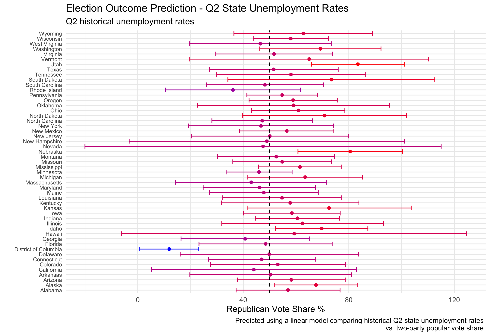
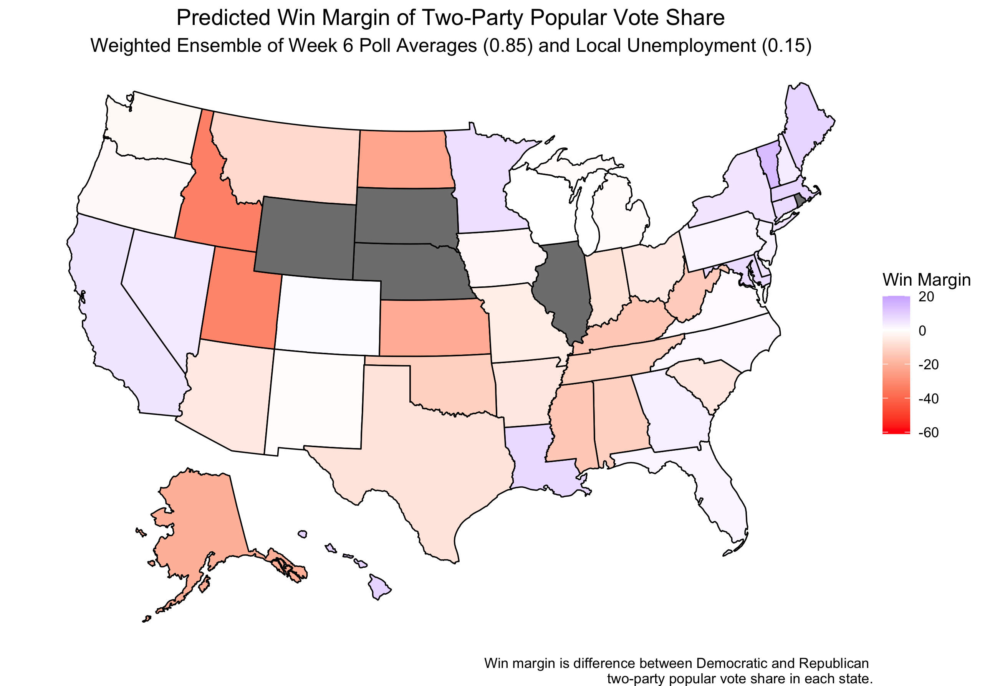

#### [Home](https://cassidybargell.github.io/election_analytics/)

# Polls
## 9/28/20

Although fundamentals, like the economy, have historically been useful for election prediction, polls provide more direct insight into the preferences of voters that might not be captured by fundamentals alone. Given the unprecedented economic circumstances of 2020, polling is all the more necessary as we cannot rely on fundamentals alone. What is a

Take for example the ranges of predicted Republican two-party vote share percentage modelled using Q2 state unemployment rates alone.* 

The error bars shown are the 95% confidence interval** for the prediction. In Nevada alone using only state unemployment data, the predicted values for Republican two-party vote share ranges from *-20%* to *114%*, both impossible percentages. As discussed previously [(state fundamentals)](https://cassidybargell.github.io/election_analytics/posts/week_2.5.html), only a few states had regression models strong enough to consider for analysis. 

This model would predict an outcome of **318** electoral college votes for Trump and **220** for Biden, however I have very little confidence in the accuracy of this model given the impossible 95% confidence interval ranges. 

Using historical averages of all polls in a state conducted 6 weeks or less out from the election, a model can also be produced predicting state outcomes for 2020. 

In comparsion to the predictions using only unemployment data, the confidence intervals for the predictions are at least within a range of possible values. (Poll averages were used rather that the outcomes of one poll in order to attempt to avoid the potential biases that can arise in a singular poll).

Using just this model based on historical polling averages, Trump would be predicted to recieve **174** electoral college votes, with Biden recieving **326** (not all states could be included in this prediction). 

A weighted ensemble, a combination of both models, can also be used to predict election outcomes. Nate Silver suggests polls are more accurate the closer to an election [Silver](https://fivethirtyeight.com/features/how-fivethirtyeights-2020-presidential-forecast-works-and-whats-different-because-of-covid-19/). Using this concept and given there are approximately 40 days left until the election, the weighting in my ensemble is ~0.85 for the economic model, and ~0.15 for the polling model.

(The states that are left gray in this model did not have sufficient polling data in order to create a prediction).

Using this weighted ensemble, the predicted electoral college votes for Trump would be **273** and for Biden would be **227**. This would be an incredibly narrow margin win for Trump, despite not all the states being included in the prediction model. 

By simply switching the weighting of the polling and economic models, one could observe a completely different result. Using a weight of ~0.85 for the polling model and ~0.15 for the economic model, the new predicted win margin map would be: 

This model predicts **220** electoral college votes for Trump and **280** for Biden.

Both of these weighted ensembles used the same predictive models, just different weights, yet presented two completely different predictions for the outcome of the election. 

Is there any way to go about reconciling these two very different outcomes? 

* *High unemployment rates favor the democratic candidate, and that effect is strongest when a Republican is incumbent, as is the case for 2020. [Wright](https://www-jstor-org.ezp-prod1.hul.harvard.edu/stable/23357704?seq=1#metadata_info_tab_contents)*

** *95% confidence interval*

*Thanks to Alison Hu for collaboration this week on code for building the predictive models.*
