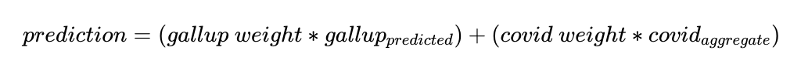

#### [Home](https://cassidybargell.github.io/election_analytics/)

# Incumbency
## 10/5/20

When all other variables are controlled, voters do not seem to prefer incumbents over challengers purely because of the status of incumbency [(Brown)](https://www-cambridge-org.ezp-prod1.hul.harvard.edu/core/services/aop-cambridge-core/content/view/ECFE39E003912F8AF65C2AD14A34BD8C/S2052263014000062a.pdf/div-class-title-voters-don-t-care-much-about-incumbency-div.pdf). Incumbents do, however, have structural advantages over challengers, like being better known to voters, being able to start their campaigns early (as Trump did), and the ability, although limited, to manipulate the economy [(Fair,](https://fairmodel.econ.yale.edu/rayfair/pdf/vote.pdf) [Achen & Bartels).](https://muse-jhu-edu.ezp-prod1.hul.harvard.edu/book/64646) It is therefore unsurprising that in the post-war era, of the 11 elections in which an incumbent has run, only three were won by the challenger.
 
Despite Trump being a first term incumbent, it is unclear how much the structural advantages of incumbency will influence this unusual election.
 
The *Time for Change* model, developed by Alan Abramowitz, has historically done well at predicting election outcomes using only Q2 GDP growth, net approval (mid-summer Gallup poll), and a variable representing whether or not the sitting president is a first term incumbent [(Abramowitz)](https://centerforpolitics.org/crystalball/articles/its-the-pandemic-stupid-a-simplified-model-for-forecasting-the-2020-presidential-election/). **Can a simple model, like that of *Time for Change*, be useful to accurately capture and predict the 2020 election despite the unusual circumstances of this election year?**
 
As I explored in my post about economic fundamentals [(9/21/20)](https://cassidybargell.github.io/election_analytics/posts/week_2.html), it is unlikely that traditional economic variables will be strong predictors for the election outcome given the pandemic. Economic evaluations have also become increasingly filtered through partisan lenses. Individuals are less likely to evaluate real economic changes than they were 20 years ago, and will rather stick to approval completely based on partisan lines [(Donovan et. al)](https://link-springer-com.ezp-prod1.hul.harvard.edu/article/10.1007/s11109-019-09539-8). This means that the structural advantage of being able to manipulate the economy in an election year might not only be more difficult because of the pandemic, but might also have less of an effect because of the polarized voter population. Joe Biden is also generally familiar to the public, having served as Obama's vice president, so he is not struggling to make a brand new impression as a challenger. 
 
Despite all of the above, approval polls still provide some insight into voter perception about how well the President is doing their job. Gallup poll approval ratings, which are generally used in the *Time for Change* model, can be visualized through time for both the Barack Obama administration and Trump's first term:
 

 
The sharp drop off in 2016 is what would be expected given increasingly partisan evaluations of candidates and economies. The [retrospective theory of political accountability](https://cassidybargell.github.io/election_analytics/posts/week_2.html) is interesting to consider in this election given that voters do have some basis on which to judge Joe Biden based on his involvement in the Obama administration [Achen & Bartels).](https://muse-jhu-edu.ezp-prod1.hul.harvard.edu/book/64646) This *potentially* could reduce the advantage an incumbent might have over a challenger who is completely unknown.
 
Given the COVID-19 pandemic, there have also been polls administered about the approval of Trump's COVID-19 response. 
 

 
These polls track each other well at the beginning of the year, however starting around late March to early April (when cases were beginning to spike significantly in the U.S.) there has been a steady decline in COVID-19 response approval while general approval has seen more fluctuations. This may be simply an artifact of the polls, however it could also reflect the idea of partisan evaluations of the President. It may suggest that opinions on COVID-19 response may not have a very strong influence on an individual's assessment overall of the President. 
 
Trump does not have full control over the economy, especially not in the context of a global pandemic.  So how then does the pandemic economy play into voter perceptions and retrospective analysis of the Trump presidency?  Being the incumbent there can be claim over some aspects like the federal COVID-19 stimulus response. 
 

 

 
Incumbents can generally expect more return from competitive states for increased election year spending [(Kriner & Reeves)](https://www-cambridge-org.ezp-prod1.hul.harvard.edu/core/services/aop-cambridge-core/content/view/962ABE4FC41A6FF3E1F95CE1B54D1ADD/S0003055414000598a.pdf/presidential_particularism_and_dividethedollar_politics.pdf). Although COVID-19 federal awards are not the only measure of election year spending, they are a unique variable for 2020 that may be more acutely felt by voters.
 
Given that vote return for increased spending is seen primarily in competitive states, it might be expected that in states with close polling averages (48-52%) there would be an increased support for the President in polling averages.
 

 
In this subset of states it does not appear this is the case, with approval polls not showing clear upward trends from the start of 2020 through the first U.S. coronavirus pandemic peak and increased relief spending. (Note that spending was not per capita or per COVID-19 case, so more investigation should be done). 
 
Alan Abramowitz, the developer of the *Time for Change* model has argued a new stance for the 2020 election in which he emphasizes the importance of presidential evaluations for predicting this election [(Abramowitz)](https://centerforpolitics.org/crystalball/articles/its-the-pandemic-stupid-a-simplified-model-for-forecasting-the-2020-presidential-election/). 
 
Given the general lack of convincing evidence suggesting there will be a strong incumbent advantage this year, I have used a similar model of combining evaluation polls to make a simple popular vote share prediction. I have chosen to include general Gallup approval polls as well as aggregate COVID-19 approval polls, weighted by Nate Silver at [FiveThirtyEight](https://projects.fivethirtyeight.com/coronavirus-polls/). 
 
A weighted ensemble can be created using aggregate COVID-19 approval ratings and a linear model using historical two-party popular vote share and Gallup general election year approval ratings.* 
 

 
Various weights can be used for sensitivity analysis of this weighted ensemble. If both general approval ratings for 2020 and Covid-19 approval aggregates are weighted equally, the predicted two-party popular vote share for Trump would be **43.8**.** 
 
I would argue, however, that the Gallup polls should be weighted more heavily than the COVID-19 approvals, because of the hyper-partisan nature of current U.S. politics, as well as the lack of any historical comparison data for pandemic response approval. If the Gallup regression is weighted at 0.75 with the COVID-19 response poll aggregate weighted 0.25, the new prediction would be slightly higher at **44.5** two-party popular vote share for Trump. 
 
If the Gallup regression is weighted at 0.9 with the COVID-19 response poll aggregate weighted 0.1, the new prediction would be slightly higher at **45** two-party popular vote share for Trump. If the 95% confidence interval upper bound for the linear regression is used rather than the model fit, however, the prediction would go to 50.6, a majority for the incumbent. 
 
If COVID-19 response is weighted more heavily, predictions remain fairly stable for Trump at around 42-45% of two-party popular vote share predictions. 
 
Even if the traditional sense of incumbency power does not play as large of a role in this election as it has in previous years, the power of incumbency should not be overlooked as it could just appear very differently from what we are accustomed to, like increased pandemic relief spending this year. 
 

 
**The Gallup linear model regression had t-values > 2 for both the coefficient and intercept at 40.04 and 28.99, respectively.*
 
***95% confidence interval for the Gallup poll regression was 38.95697 to 51.54405, however there is increased variation expected in the model because of the inclusion of the COVID-19 approval aggregates. Approximate confidence intervals can be found by running the code for Week 4 on my github.*
