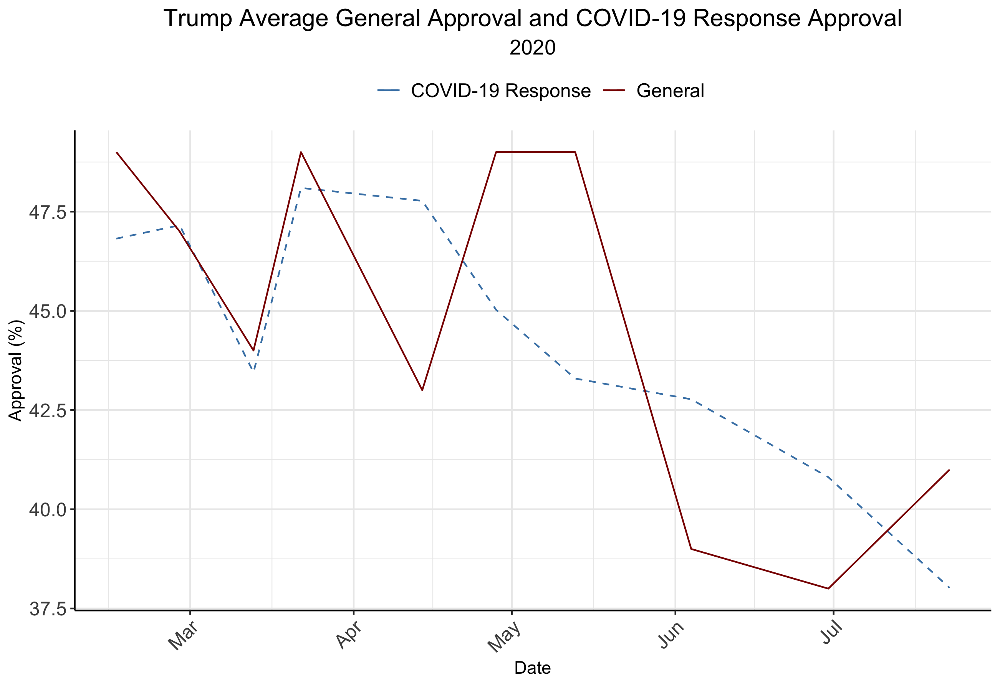
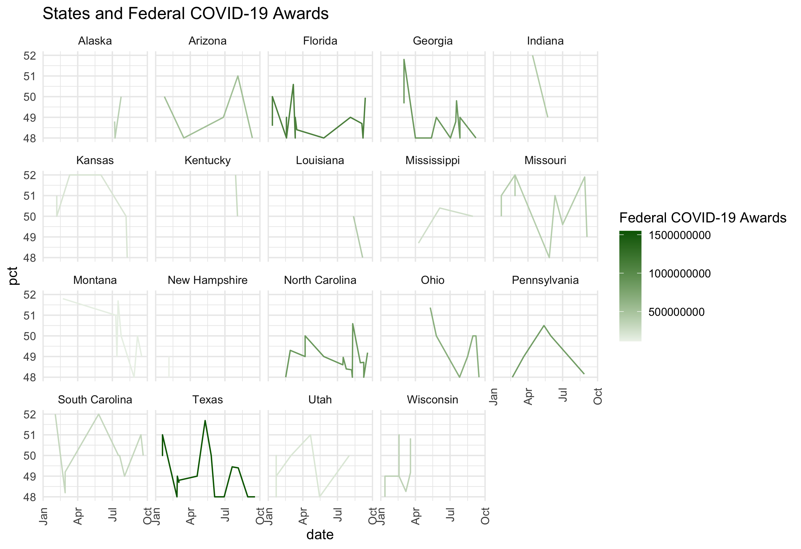

#### [Home](https://cassidybargell.github.io/election_analytics/)

# Incumbency
## 10/5/20

When everything else is controlled for, voters do not seem to prefer incumbents over challengers purely because of the status of incumbency [(Brown)](https://www-cambridge-org.ezp-prod1.hul.harvard.edu/core/services/aop-cambridge-core/content/view/ECFE39E003912F8AF65C2AD14A34BD8C/S2052263014000062a.pdf/div-class-title-voters-don-t-care-much-about-incumbency-div.pdf). Incumbents do, however, have structural advatanges over challengers, like being less of an unknown for voters, being able to start their campaigns early (as Trump did), and the ability, although limited, to manipulate the economy [(Fair,](FAIR LINK HERE) [Achen & Bartels).](https://muse-jhu-edu.ezp-prod1.hul.harvard.edu/book/64646) It is therefore unsurprising that in the post-war era, of the 11 elections in which an incumbent has run, only 3 were won by the challenger.

Despite Trump being a first term incumbent, it is unclear how much the structural advantages of incumbency will influence this unusual election.

The *Time for Change* model, developed by Alan Abramowitz, has historically done well at predicting election outcomes using only Q2 GDP growth, net approval (mid-summer Gallup poll), and a variable representing whether or not the sitting president is a first term incumbent [(Abramowitz)](LINK HERE). **Can a simple model, like that of *Time for Change*, be useful for accurately capturing and prediciting the 2020 election despite the unsual circumstances of this election year?**

As I explored in my post about economic fundamentals [(9/21/20)](https://cassidybargell.github.io/election_analytics/posts/week_2.html), it is unlikely that traditional economic variables will be strong predictors for the election outcome given the pandemic. Economic evaluations have also become increasingly filtered through partisan lenses. Individuals are less likely to evaluate real economic changes than they were 20 years ago, and rather stick to approval completely based on partisan lines [(Donovan et. al)](https://link-springer-com.ezp-prod1.hul.harvard.edu/article/10.1007/s11109-019-09539-8). This means that the structural advantage of being able to manipulate the economy in an election year might not only be more difficult because of the pandemic, but might also have less of an effect because of the polarized voter population. Joe Biden is also generally familiar to the public, having served as Obama's vice president, so he is not struggling to make a brand new impression as a challenger. 

Despite all of the above, approval polls still provide some insight into voter perception about how well the President is doing their job. Gallup poll approval ratings, which are generally used in the *Time for Change* model, can be visualized through time for both the Barack Obama administration and Trump's first term:

The sharp drop off in 2016 is what would be expected given increasingly partisan evaluations of candidates and economies. The [retrospective theory of political accountability](https://cassidybargell.github.io/election_analytics/posts/week_2.html) is interesting to consider in this election given that voters do have some basis on which to judge Joe Biden given his involvement in the Obama administration [Achen & Bartels).](https://muse-jhu-edu.ezp-prod1.hul.harvard.edu/book/64646) This *potentially* could reduce the advantage an incumbent might have over a challenger who is completely unknown.

Given the COVID-19 pandemic, there have also been polls administered about the approval of Trump's COVID-19 response. 

These polls do track each other well at the beginning of the year, however starting around late March to early April (when cases were beginning to really spike in the U.S.) there has been a steady decline in COVID-19 response while general approval has seen more fluctuations. This may be simply an artifact of the polls, however it could also reflect the idea of partisaned evaluations of the President. It may suggest that opinions on COVID-19 response may not have a very strong influence on an individual's assessment overall of the President. 

Trump does not have full control over the economy, especially not in the context of a global pandemic, so how then, does the pandemic economy then play into voter perceptions and retrospective analysis of the Trump presidency?  Being the incumbent there can be claim over some aspects like federal COVID-19 awards. 

- What does the distribution of covid awards look like across states?

 - Incumbents can generally expect more return from competitive states for increased election year spending [(Kriner & Reeves)](https://www-cambridge-org.ezp-prod1.hul.harvard.edu/core/services/aop-cambridge-core/content/view/962ABE4FC41A6FF3E1F95CE1B54D1ADD/S0003055414000598a.pdf/presidential_particularism_and_dividethedollar_politics.pdf). 

Alan Abramowitz, the developer of the *Time for Change* model has argued a new stance for the 2020 election in which he emphasizes the importance of presidential evaluations for predicting this election [(Abramowitz)](https://centerforpolitics.org/crystalball/articles/its-the-pandemic-stupid-a-simplified-model-for-forecasting-the-2020-presidential-election/). 

Given the general lack of convincing evidence suggesting there will be a strong incumbent advantage this year, I have used a similar model of combining evalution polls to make a simple popular vote share prediction. 