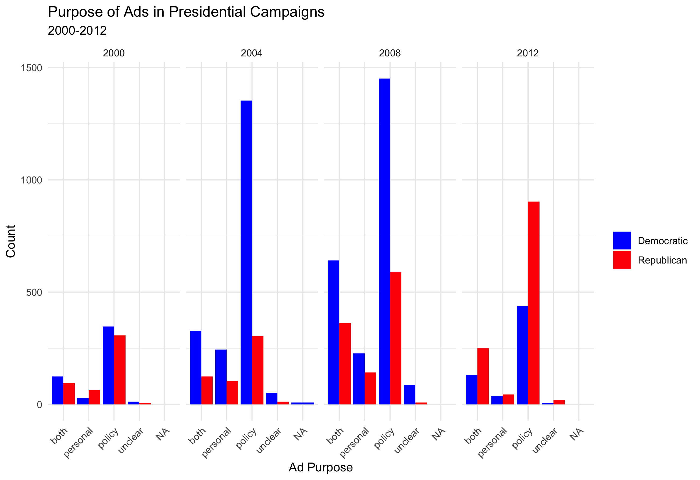
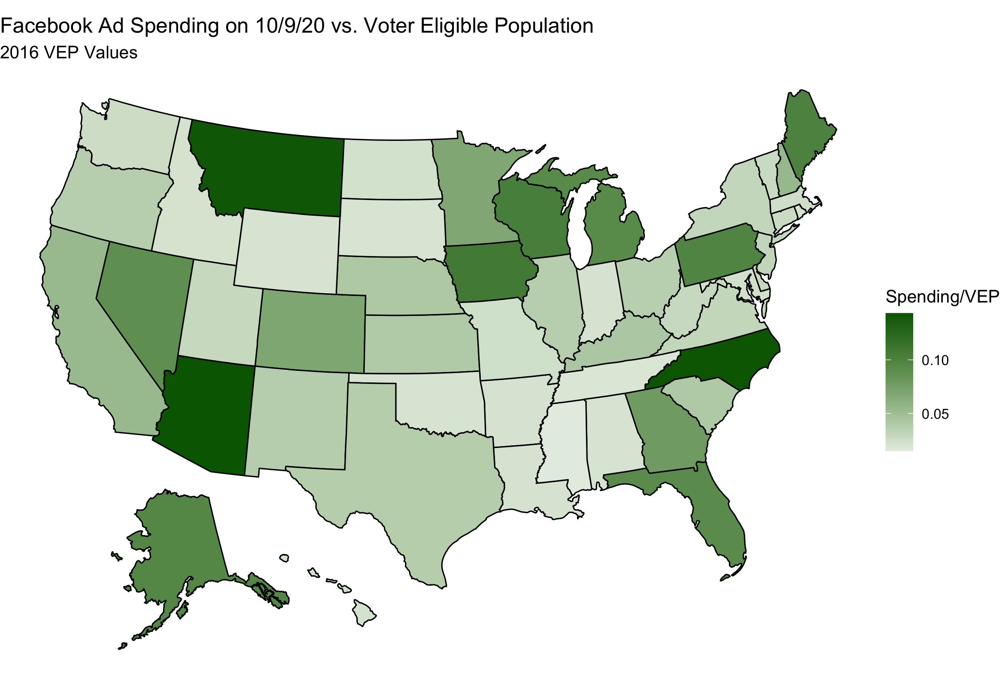
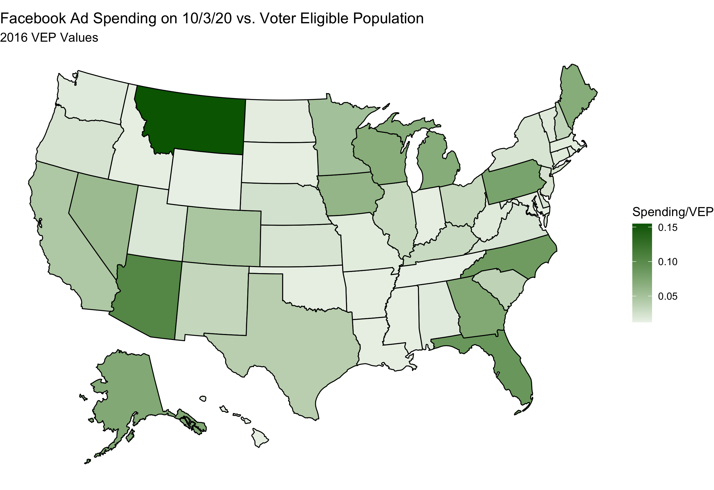

#### [Home](https://cassidybargell.github.io/election_analytics/)

# The Air War
## 10/12/20

Each Presidential election, campaigns spend large sums of money on advertisement alone. Since September 5th, total TV ad spending sponsored by Biden and Trump totals over 136 million dollars [(Wesleyan Media Project)](https://mediaproject.wesleyan.edu/releases-100120/). **What effect will advertisement spending have on the 2020 election?**

Even with hundreds of millions of dollars being spent, the impact  of ads remains unclear as the effects of advertisements are difficult to isolate. In a randomized experiment of media ad spending during the 2006 reelection campaign of Texas governor Rick Perry, Gerber et al. found strong evidence the persuasive impact of advertisement rapidly decays [(Gerber et al.)](https://www-cambridge-org.ezp-prod1.hul.harvard.edu/core/journals/american-political-science-review/article/how-large-and-longlasting-are-the-persuasive-effects-of-televised-campaign-ads-results-from-a-randomized-field-experiment/DA29FE8A5581C772006A1DEBB21CFC4C). They suggest that ads prime people for various considerations when they are going to evaluate a candidate, but are not where people really learn about candidates in the long term. This emphasizes the importance of timing for ad spending. 

Huber et al. exploited the accidental experimental condition of media markets that overlap into non battleground states to examine the effects of campaign advertisements [(Huber et al.)](https://onlinelibrary-wiley-com.ezp-prod1.hul.harvard.edu/doi/pdfdirect/10.1111/j.1540-5907.2007.00291.x). They found that advertisements are more persuasive than they are mobilizing or informative for voters. There is a subset of the population, however, that is persuadable, made up of people who are engaged enough to be exposed to campaign information, but not so engaged to have developed strong beliefs [(Huber et al.)](https://onlinelibrary-wiley-com.ezp-prod1.hul.harvard.edu/doi/pdfdirect/10.1111/j.1540-5907.2007.00291.x). 

Huber et al. also discuss the implications of their findings on the democratic process in general. They suggest that the tone and purpose of advertisements are important in considering the ways in which advertisements are actually persuasive [(Huber et al.)](https://onlinelibrary-wiley-com.ezp-prod1.hul.harvard.edu/doi/pdfdirect/10.1111/j.1540-5907.2007.00291.x). Rather than a focus on issues and policies, by an increased focus on contrasting and attacking the opposition, ads may actually only be persuasive about the character of candidates.

Trends in tone and purpose of campaigns since 2000 are visualized below.

Advertisement counts have clearly increased over the years. Although policy dominates the purpose of ads through these four elections, both policy and personal advertisements have also continued to trend upward.

A noteworthy trend is the fact Democratic ad spending strongly outweighs Republican ad spending in years when the Democratic party is the challenger. (Perhaps this is indicative of awareness of the [incumbency advantage?](https://cassidybargell.github.io/election_analytics/posts/week_4.html)).

It has been abundantly clear normal predictive measures are not proving extremely useful given the incredibly unique circumstances of 2020. One might think that advertisements could be expected to be relatively stable this year, however I would argue that this might not be as true as expected. 

Social media usage has continued to skyrocket since 2016. From 2016 to 2019 there was an increase of over 600,000,000 million users on Facebook [(https://ourworldindata.org/rise-of-social-media)](https://ourworldindata.org/rise-of-social-media). Tiktok, a popular video app was created in 2016 and has already proven a controversial topic in American politics [("Trump Administration to Ban TikTok and WeChat From U.S. App Stores")](https://www.nytimes.com/2020/09/18/business/trump-tik-tok-wechat-ban.html). What role will social media play in the 2020 election? The hard part about prediction using social media data is that there is relatively little historical information to compare this election to. Analyzing  spending and use trends can still provide insight into how social media has increasingly become an important facet of advertisement in election campaigns. 

Since September 5th 2020, Trump has spent over \$23,453,782 on both Facebook and Google+ ads, whereas Biden has spent over \$32,566,575. Including data from mid-April, Trump has spent \$135,230,620 on Facebook & Google+ ads, whereas Biden has spent \$101,768,019. This indicates Biden has increased spending closer to the election while Trump started heavy spending much earlier. 

Another interesting point to note is that Trump has continuously outspent Biden on Facebook ads, whereas within the past month or so Biden has spent much more than Trump on Google+ ads. 

The [Facebook Ad Library](https://www.facebook.com/ads/library/report/?source=archive-landing-page&country=US) provides data about spending for ads on Facebook about social issues, elections or politics. Spending by any political organization is included in the data, however the top three spenders are Joe Biden, Facebook, and Donald Trump. (The Facebook ads seem to be ads encouraging voting rather than any partisan leaning, but it is unclear whether this is true for all advertisements Facebook Inc. buys itself.)

Spending in just one day (10/9/20) by state is below.

This graph appears predictable given differences in populations of states. If total spending is divided by the voter eligible population of each state in 2016 ad spending on 10/9/20 looks like this:

Not unexpectedly, many of the states identified as battleground states seem to have increased spending levels. This aligns with trends in television advertisement where battleground states are the focus of campaigns.* Spending is greatest in Arizona with around ~\$0.143 spent per eligible voter in the state, followed closely by North Carolina at ~\$0.142. There are clear limitations to this data, one being that it is using voting eligible population from 2016, and that it is from only one day. Data from a week earlier, October 3rd, is similar. 

Although campaigns are spending big on social media advertisements, social media also has unique political components that are not related to ad spending. Social media creates space for people to widely share their own personal opinions, and it also creates echo chambers, like private Facebook groups in which everyone shares some common opinion. 

These variables are not as easily trackable as ad spending. People have more choice (or pseudo-choice, due to algorithms predicting what users will like on social media) over what they interact with, potentially also strengthening the extreme partisanship that is increasingly common in the U.S. 

As social media continues to become more omnipresent in the presidential election process, it is likely more controversies, like the 2016 Russian interference, to become of concern. Although it may currently be difficult to predict how much advertisement, especially over social media, will play in the 2020 election, I expect it will be an increasingly common question and concern in future election cycles.

**I am not entirely clear on what is happening in Montana, and requires further investigation.*
