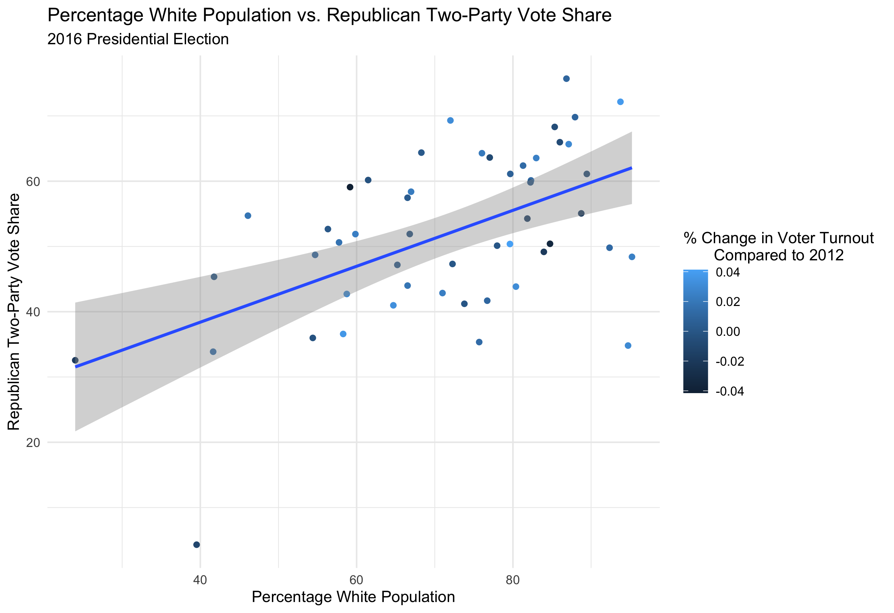
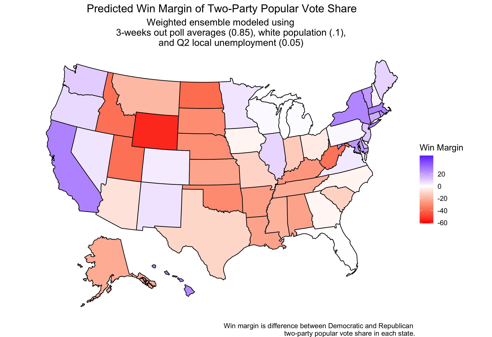
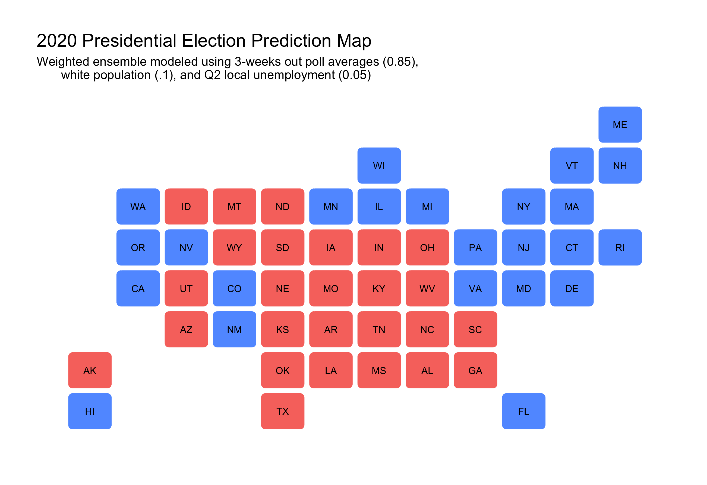
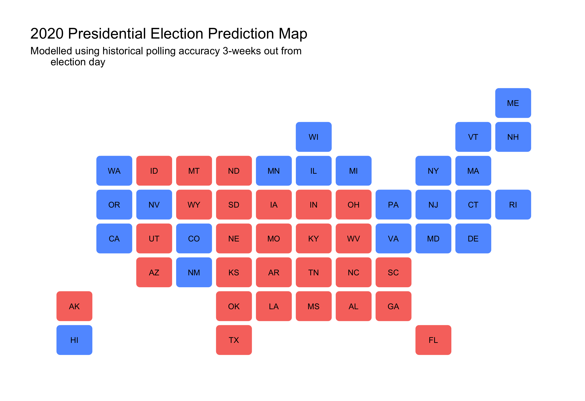
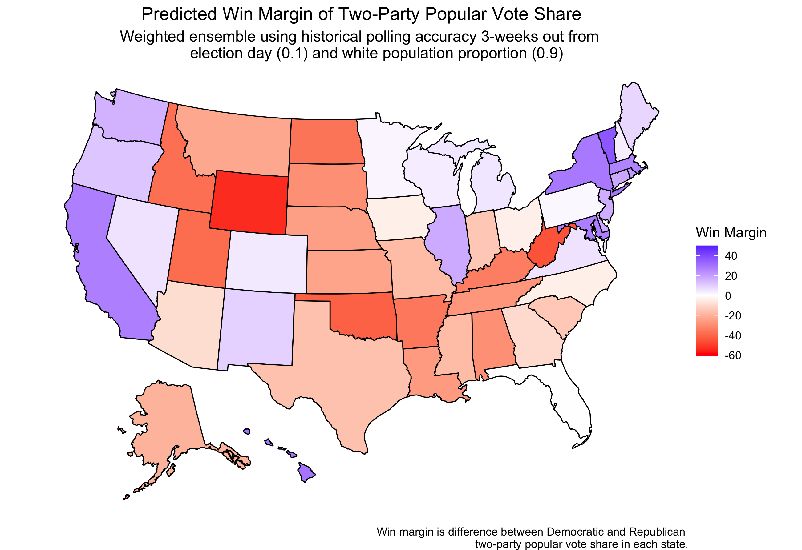

#### [Home](https://cassidybargell.github.io/election_analytics/)

# Ground Game and Demographics
## 10/18/20

Although very large sums of money are spent on the air war and advertising, money spent on the ground game can be very effective for voter mobilization [(Enos & Fowler).](https://www-cambridge-org.ezp-prod1.hul.harvard.edu/core/journals/political-science-research-and-methods/article/aggregate-effects-of-largescale-campaigns-on-voter-turnout/20C500B0DE62227873FD24CB3555F779). In this case the ground game is individualized contacts, which can range from mail, phone calls and actually knocking on doors, rather than mass media. Although each contact may not have large effects, there is evidence of significant aggregate effects of an effective ground campaign [(Enos & Fowler).](https://www-cambridge-org.ezp-prod1.hul.harvard.edu/core/journals/political-science-research-and-methods/article/aggregate-effects-of-largescale-campaigns-on-voter-turnout/20C500B0DE62227873FD24CB3555F779). 

A complex infrastructure required to run a large scale ground campaign in comparison to running ads. Once again, coronavirus makes this year different to previous election years. Traditional forms of ground game, like knocking on doors have been reduced, and even offices that organize ground organizations are likely limited by the pandemic. Biden has invested less in the ground game amid the pandemic than candidates have in previous elections. 

Demographics can also be useful for understanding how a certain population is likely to vote. In 2016, there was a positive correlation between percentage of state population which is white and republican two-party popular voteshare. 



The linear model is statistically significant, ```R_pv2p = 0.658(white_pct) + 37.514``` with t-values 4.672 and 4.386 for the intercept and slope respectively (both > 2, so the null hypothesis that there is no correlation is rejected). 


In 2016 polls were generally Democrat-biased, although they were generally as acurate as they had been in the past [(538)](https://fivethirtyeight.com/features/the-polls-are-all-right/). In 2016 Trump dominated votes from white uneducated voters, which may have also been underrepresented in polling data. 







