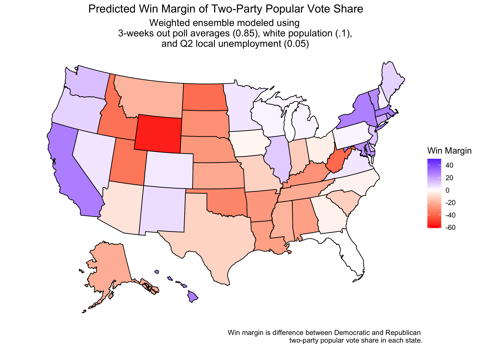

#### [Home](https://cassidybargell.github.io/election_analytics/)

# Ground Game and Demographics
## 10/18/20

Although very large sums of money are spent on the air war and advertising, money spent on the ground game can be very effective for voter mobilization [(Enos & Fowler).](https://www-cambridge-org.ezp-prod1.hul.harvard.edu/core/journals/political-science-research-and-methods/article/aggregate-effects-of-largescale-campaigns-on-voter-turnout/20C500B0DE62227873FD24CB3555F779). In this case the ground game is individualized contacts, which can range from mail, phone calls and actually knocking on doors, rather than mass media. Although each contact may not have large effects, there is evidence of significant aggregate effects of an effective ground campaign [(Enos & Fowler).](https://www-cambridge-org.ezp-prod1.hul.harvard.edu/core/journals/political-science-research-and-methods/article/aggregate-effects-of-largescale-campaigns-on-voter-turnout/20C500B0DE62227873FD24CB3555F779). 

A complex infrastructure required to run a large scale ground campaign in comparison to running ads. Once again, coronavirus makes this year different to previous election years. Traditional forms of ground game, like knocking on doors have been reduced, and even offices that organize ground organizations are likely limited by the pandemic. Biden has invested less in the ground game amid the pandemic than candidates have in previous elections. 

Demographics can also be useful for understanding how a certain population is likely to vote. In 2016, there was a positive correlation between percentage of state population which is white and republican two-party popular voteshare. 


The linear model is statistically significant, ```R_pv2p = 0.658(white_pct) + 37.514``` with t-values 4.672 and 4.386 for the intercept and slope respectively (both > 2, so the null hypothesis that there is no correlation is rejected). 

*Although the ground game might be less prominent in this election year, how can demographic data potentially guide predictive models?*

<hr>

In 2016 polls were generally Democrat-biased, although they were generally as acurate as they had been in the past [(538)](https://fivethirtyeight.com/features/the-polls-are-all-right/). In 2016 Trump dominated votes from white uneducated voters, which therefore may have been a demographic underrepresented in polling data. 

A weighted ensemble using updated state poll aggregates from October 18th and Q2 unemployement rates can also include a model that uses the percentage of white people in a state in 2018 verus the historical Republican two-party vote share.

I have initially chosen the weighting of the ensemble based on various assumptions. As Nate Silver suggests, polls likely get more accurate the closer to an election, so I have weighed them most heavily in my model ([Silver])(https://fivethirtyeight.com/features/how-fivethirtyeights-2020-presidential-forecast-works-and-whats-different-because-of-covid-19/). Given the extreme unreliability of this years economic data for forecasts, I have weighted the model based on white percentage of the population more heavily than the unemployment model. Demographics did not change dramatically because of COVID-19, so might provide a more constant factor to include in the final model.  




This weighted ensemble predicts a Biden win with *305* electoral college votes, and Trump with *230*.

For sensitivity analysis, I have chosen to give no weight to the unemployment rates, and instead compare how weighting the polling and demographic predictive models differently changes the predicted outcome. 

If polling is weighted more heavily, at 0.9 and demographics at 0.1, the predicted outcome is a narrow Biden win with *276* electoral college votes, and *259* for Trump.


If demographics (only white population proportion) are weighted more heavily, the electoral outcome is the same, with Biden winning *276* electoral college votes and Trump winning *259*. 


Because changing the weights in these models did nothing to the final outcome prediction, and given the unparalleled economic data of 2020, I would argue these models are likely better predictors than the initial model which included state unemployment rates.

However, the only state that flips using unemployment data is Florida. Without the unemployment data, the prediction outcomes for Florida are still extremely marginal, at a 50.068% popular vote share for Trump in the model relying on demographics, and a 50.14497% popular vote share for Trump in the model relying on polling. 

In 2016 Trump won Florida also by a razor thin margin. It will be interesting to see how the election plays out in states like Florida that are likely to be won very narrowly in a year when mail in ballots and controversy are likely to make election night more chaotic than typical.
