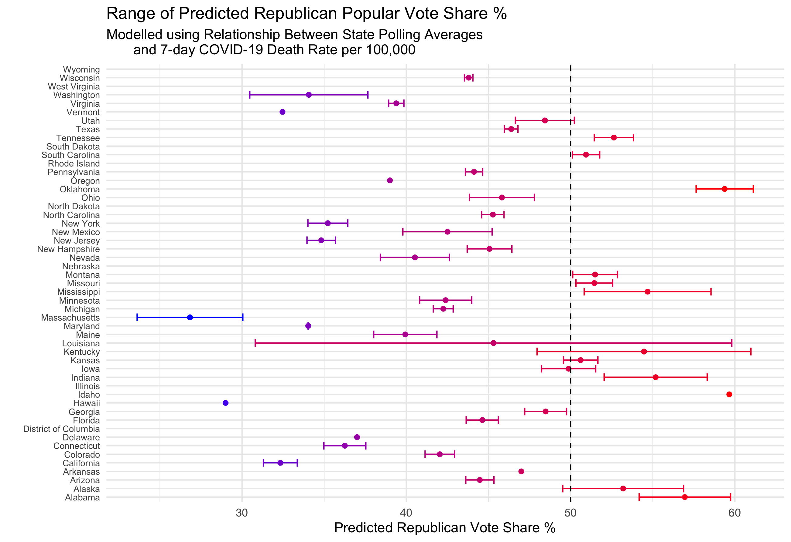

#### [Home](https://cassidybargell.github.io/election_analytics/)

# Shocks
## 10/26/20

Theory - timing of shocks in 2020, covid rates spike close to election, use 7 day rates in a model between state polling averages and 7 day covid death rates, big spikes in COVID death rates might be the most recent shock that could impact the election. Reality - use reference for Iraq paper that the incumbent will likely be differentially impacted by COVId-19 death rates depending on a states partisanship. Also possible governors recieve more retrospective voting punishment than the incumbent does. Retain prediction model from previous week as stronger in my opinion. 

The 2020 election has been full of unexpected events, its hard to even recall all of the developments that could be considered major shocks. The impeachment, civil unrest and riots, the death of Ruth Bader Ginsberg could all be considered large enough shocks that might impact the election in some way. The global COVID-19 pandemic is yet another a shock to this election that has had deep and lasting impacts on nearly every aspect of society. 

As I have discussed in previous weeks, the pandemic has already made predicting this election difficult. Economic factors which are typically included in predictions, like Q2 GDP and unemployment rates, are so unprecedented they have lost predictive power in models that use historical data. Even if the pandemic is not directly included in a certain model, its impact on other fundamental and campaign factors has been profound. 

Although not a traditional October surprise because it is not entirely unexpected, the "second wave" of COVID-19 cases is beginning to be experienced across many states. The pandemic as a whole can be considered shock to the election, but *what effect might spikes of cases and deaths near election day have on the final outcome?*

First I wanted to model polling aggregates versus per capita deaths in states in order to examine if there is any measurable relationship between COVID-19 deaths and polling.

Although not all states are included in this model, as some did not have sufficient polling information. There does appear to be a statistically significant (t-values >2, median residual of 0.0649) negative relationship; the model predicts each 0.0005 increase in per capita deaths in a state results in a 1.756 decrease in poll support for the incumbent. 

The concept of "casualty sensitivity" of the American public was explored by [Karol & Miguel](https://www-journals-uchicago-edu.ezp-prod1.hul.harvard.edu/doi/pdfplus/10.1111%2Fj.1468-2508.2007.00564.x) in their paper examining the effects of causualties in the Iraq war on President Bush's 2004 election. They suggest that casualties in Iraq did negatively impact Bush's final vote share, and the localized effects were most substantive. The casualties from Iraq by election day were around 3.39 per 100,000 people [Karol & Miguel](https://www-journals-uchicago-edu.ezp-prod1.hul.harvard.edu/doi/pdfplus/10.1111%2Fj.1468-2508.2007.00564.x). The deaths from COVID-19 currently stands at 68.84 per 100,000, so if the population is still sensitive to casualties in a similar way to 2004 you would expect these deaths would negatively impact the incumbent [(Johns Hopkins Mortality Analyses)](https://coronavirus.jhu.edu/data/mortality). 

Given how states have experienced differing levels of severity of COVID-19 effects thus far, I would also expect the effect of deaths to vary dependent on state. 

[*COVID-19 death rates from the CDC](https://covid.cdc.gov/covid-data-tracker/#cases_deathsper100k)

Based only on recent state polling aggregates (10-18-20), and deaths per 100,000 (as of 10-20-20), the negative relationship between increased deaths and polling support for the incumbent is still present. 

This model estimates that for every additional COVID-19 death per 100,000, a decrease in poll support for Trump by 0.085 percentage points (t = -2.139). 

When stratified based on the party who won the majority popular vote in 2016, the strength of the negative relationship is severly diminished. This suggests that the negative relationship between COVID-19 deaths and poll support for the incumbent may be more of an artifact of state partisanship. Logically, states that vote blue are generally more urban, and therefore intrinsically less social distanced. These states, like New York may, expierence the effects of the pandemic more severly and would also show lower poll support for Trump. 

In their paper, [Karol & Miguel](https://www-journals-uchicago-edu.ezp-prod1.hul.harvard.edu/doi/pdfplus/10.1111%2Fj.1468-2508.2007.00564.x) did find that Bush was hurt more in blue states by casualties than he was in red states (with no significant difference for battleground states). A similar effect due to partisanship may be probable for the effects of COVID. Trump may loose more votes in states he was already unlikely to win. 

As popular vote does not decide the election, the real question is how much COVID-19 spikes may impact the electoral college outcome. 

Using state poll aggregates from throughout 2020 and matching by date with the 7 day change in COVID-19 deaths, I have created a model for each state. Using the most recent COVID-19 death rate, I have used each model to predict support for the incumbent. Polling averages in this case are directly representing projected vote share as there is no historical election data on which to model this situation.  

Some states only have one poll average throughout 2020, and are represented by a single point without a confidence interval. Other states without sufficient polling data were ommitted completely. 

This particular model using only COVID-19 rates and polling averages predicts a landslide win for Biden with *426* electoral college votes and Trump recieving *66* (the remaining 46 votes from states that were not modelled, but the outcome is desisive). 

This large of a win seems unlikely, especially given how much COVID-19 has become a partisan issue. I would not expect some safe red states to swing left purely because of an increase in COVID-19 death rates for a variety of reasons. For example, blame might be placed further down the ballot, or economic recovery might be valued more heavily than changes in death rates. 

Some states create models that seem more predictive than others, like Colorado. In the seven states that are predicted to be the closest by [Elliot Morris of the Economist](https://projects.economist.com/us-2020-forecast/president), the models created using this data seem to have little to no real predictive power. (Using this model, all of these 7 states are predicted to vote blue, with not one having a confidence interval that includes a potential Republican win).

I do think COVID-19 will have an impact on the final election outcome, although the extent to which is difficult to predict.

Although COVID-19 is a virus, it has gained a partisan tint throughout the year, with disagreements over severity and policy having become increasingly political. Given the findings of [Karol & Miguel](https://www-journals-uchicago-edu.ezp-prod1.hul.harvard.edu/doi/pdfplus/10.1111%2Fj.1468-2508.2007.00564.x), I would expect the biggest impact on the incumbent will be felt in already securely blue states. 

In contrast to my model last week that used only polling and demographic data, I would expect at least one of the following seven states, Florida, Iowa, Georgia, North Carolina, Arizona, Texas or Ohio, to swing blue. If Florida swings blue, which is predicted in both my weighted ensemble that includes economic data and this weeks COVID-19 model, I would predict a Biden win with *305* electoral college votes, and Trump with *230*. 

