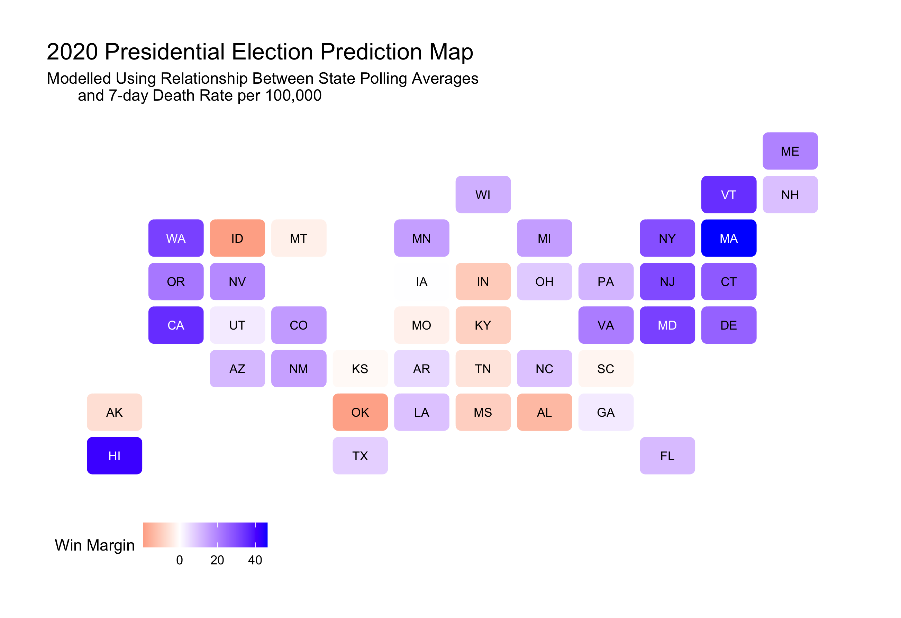

#### [Home](https://cassidybargell.github.io/election_analytics/)

# Shocks
## 10/26/20

Theory - timing of shocks in 2020, covid rates spike close to election, use 7 day rates in a model between state polling averages and 7 day covid death rates, big spikes in COVID death rates might be the most recent shock that could impact the election. Reality - use reference for Iraq paper that the incumbent will likely be differentially impacted by COVId-19 death rates depending on a states partisanship. Also possible governors recieve more retrospective voting punishment than the incumbent does. Retain prediction model from previous week as stronger in my opinion. 

*CDC for COVID-19 7-day death rate as of Oct. 20